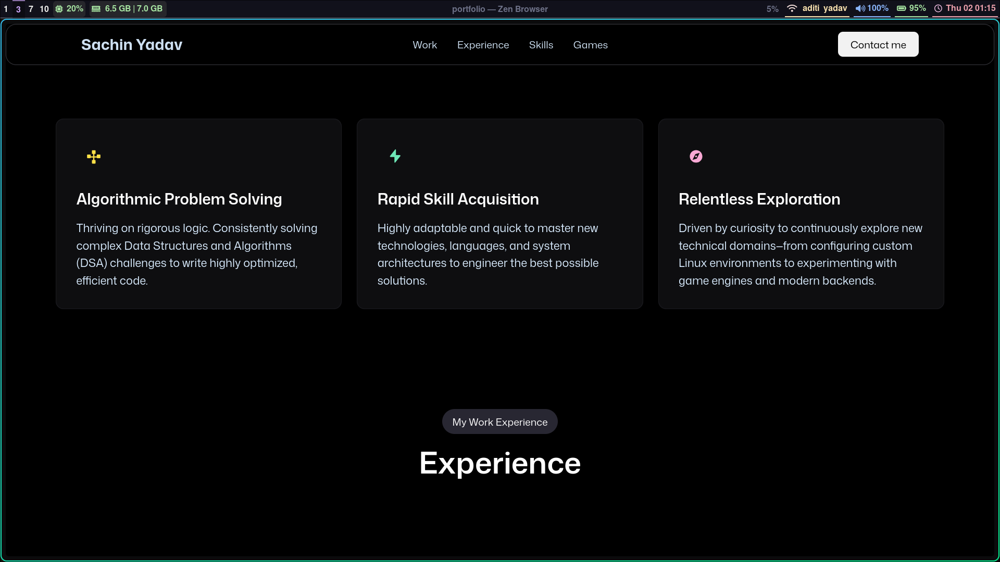
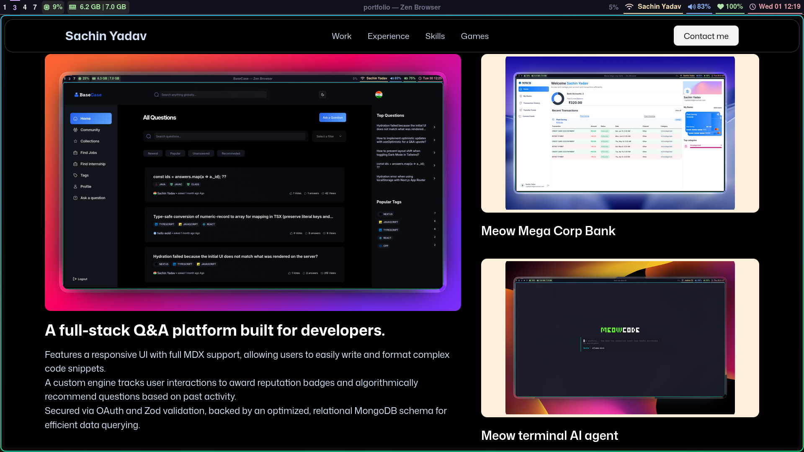
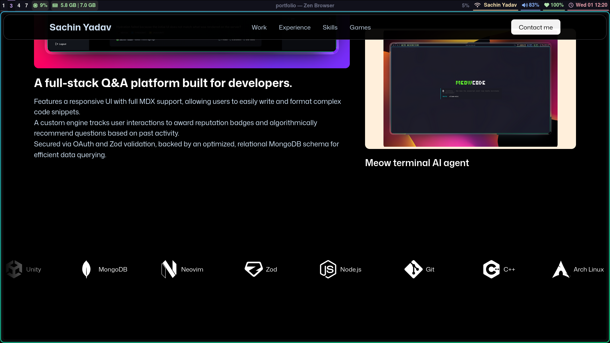

# Portfolio

#### 1 july 2026
- [x] UI for ablities and started experience section
- 

#### 1 july 2026
- [x] showcase and Navbar
- 
- [x] marquee using react-icons
- 

#### 30 june 2026
- [x] reading particals of character
- 
- [x] basic UI for showcase section
- 

#### 29 june 2026
- [x] using threejs to make basic shapes
- 
- [x] using gltfjs to make .tsx from .glt
- 

#### 28 june 2026
- [x] Created a new project
- 
- [x] hero text
- 

