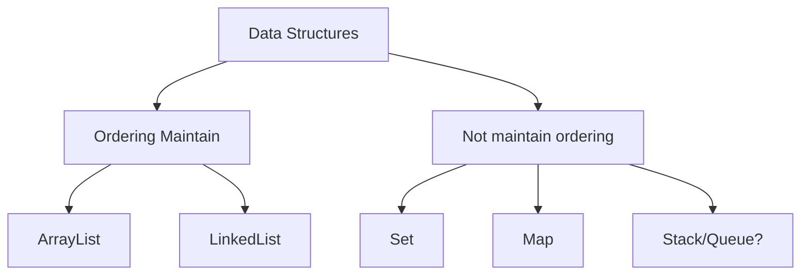

In programming we deal with data -> put data in object
Need to query the data for that need Data Structure
#### Data Structure
It is need to store and query the data effectively
```java
arr=[4,7,19,12,34];
```
easy to add number O(1)
find largest/any number O(n)
example can use sorted array. -> insert O(n) and search O(logn)

> [!NOTE]
> There is no best data structure it is a trade-off which is best for our particular problem

Like C++ STL -> java also provides support to all data structure
We can also make our own data structure by `OOPs` 
##### `ArrayList`
example : to make dynamic array
- It will have variable size 
- internal have a fixed size array 
- when adding fills the array copy it to new bigger array
```java
class DA<T>{
    private T arr;
    int i=0;
    DA(int sz){
        arr=new T[sz];
    }
    void add(T t){
        arr[i]=t;
        i++;
    }
    T get(int i){
        if(i>this.i) return null;
        return arr[i];
    }
    void insert(int i,T t){
        if(i>this.i) return;
        while(this.i>i) arr[this.i--]=arr[this.i];
        arr[i]=t;
    }
}
```
Solved by `ArrayList` which implements interface `List`
##### `LinkedList`
need to do many insertion where insertion should be O(1) anywhere --> like in `LinkedList`
but we don't have contiguous memory
but look is taking long time --> O(n) always
example : 
```java
public class demo {
    public static void main(String[] args) {
        Node n1=new Node(10,null);
        Node n2=new Node(20, n1);
        Node n3=new Node(30, n2);

        Node temp=n3;
        while(temp!=null){
            System.out.println(temp.val); // 30 20 10
            temp=temp.next;
        }
    }
}
class Node {
    int val;
    Node next;
    Node(int val,Node next){
        this.val=val;
        this.next=next;
    }
}
```
like this connect nodes
have class `LinkedList`
- `add(T a)` -> add value in it
- `insert(T a, int pos)` -> also in O(1)
- can have basic example of internal class
```java
public class demo {
    public static void main(String[] args) {
        LL l=new LL();
        l.add(1);
        l.add(2);
        l.add(3);
        l.print(); // 1 2 3
    }
}
class LL{
    private static class Node{
        int val;
        Node next;
        Node(int val,Node next){
            this.val=val;
            this.next=next;
        }
    }
    Node head=null;
    public void add(int val){
        Node node=new Node(val,null);
        if(head==null){
            head=node;
            return;
        }
        Node temp=head;
        while(temp.next!=null){
            temp=temp.next;
        }
        temp.next=node;
    }
    public void print(){
        Node temp=head;
        while(temp!=null){
            System.out.println(temp.val);
            temp=temp.next;
        }
    }
}
```
##### `Set`
If many number to insert, but duplicate are not allowed 
- insert O(1)
- lookup O(1) / contains
like implement as hash map -> to store `hsh[i]` is 1 if i exist in array thus, it will make O(1) lookup
will have only 1 -> unique
for negative or any number by using (divide in half for negative number/and use modulo for out of range numbers)

we have `HashSet` and `LinkedHashSet` 
### `Stack/Queue`
Stack follow FILO. has only one side `top` put at `top` and pop from `top`
Queue follow FIFO. has two side front and rear
java has `Queue`, `ArrayDeque`,`Stack`
##### `Map`
key value pairs
get value at key in O(1) -> duplicate keys not-allowed-ed
like store node in a set / can do pair insertion
Java provides `HashMap`,`LinkedHashMap`
##### `Tree`
for hierarchical form e.g binary search tree, file and folder
```java
class TreeNode<T>{
    T data;
    TreeNode<T> left;
    TreeNode<T> right;
}
```
can make binary tree using this
java has `TreeSet`,`TreeMap` store data in form of self-balancing-BST
![[Pasted image 20260604181231.png]]
all are data structure will have inheritance and polymorphic to avoid duplicate code
Thus all `ArrayList`,`LinkedList` have `add()` `remove()` implemented in both.
Every thing in Iterable can be used in `foreach loop`
Here is the Mermaid text for the image, representing the flowchart structure:

thus loop won't work for every collectible thus, use `foreach`loop
#### Iterable
Iterable: It is the root interface that represent any object whose element can be traversed one by one.
- `.hasNext()` -> It say weather have next
- `.next()` -> gives next
- `.iterator()` -> it is actual object of each element.
```java
import java.util.List;
import java.util.ArrayList;
import java.util.Iterator;

public class demo {
    public static void main(String[] args) {
        List<Integer> list = new ArrayList<>();
        list.add(1);
        list.add(2);
        list.add(3);
        list.add(4);
        list.add(5);
        list.add(6);
        list.add(7);
        list.add(8);
        list.add(9);
        list.add(10);

        Iterator<Integer> it = list.iterator();
        while (it.hasNext()) {
            System.out.println(it.next());
        }
    }
}
```
This method with iterator will work for any iterator -> `ArrayList`,`LinkedList`,`HashSet`,`ArrayDeque`,`TreeSet`...
Internally working
- This iteratable class implements this `.iterator()`
#### How different collections conceptually implement iterate/iterator
##### ArrayList
```java
class ArrayList implements Iterable{
	private Intger[] arr;
	private int size;
	class ArrayListIterator implements Iterator{
		int pos=0;
		@Override
		public boolean hasNext(){
			return pos<size;
		}
		@Override
		public int next(){
			return arr[pos++];
		}
	}
	@Override
	public Iterator iterator(){
		return new ArrayListIterator();
	}
}
```
##### LinkedList
```java
class LinkedList implements Iterable{
	static class node{
		int data;
		Node next;
	}
	Node head;
	class ArrayListIterator implements Iterator{
		Node curr=head;
		@Override
		public boolean hasNext(){
			return curr!=null;
		}
		@Override
		public int next(){
			int x=curr.data;
			curr=curr.next();
			return x;
		}
	}
	@Override
	public Iterator iterator(){
		return new ArrayListIterator();
	}
	// ...(add,remove,etc)
}
```
similar iterator for `HashSet`,`Queue`
make own iterator
```java
import java.util.*;

public class demo {
    public static void main(String[] args){
        String[] n={"Mike","Tom","John"};
        NameContainer nc=new NameContainer(n);
        Iterator<String> it=nc.iterator();
        while(it.hasNext()){
            System.out.println(it.next()); // Mike Tom John
        }
    }
}
class NameContainer implements Iterable<String>{
    private String[] name;
    private int size;
    NameContainer(String[] n){
        name=n;
        size=n.length;
    }
    NameContainer(){
        name=new String[0];
        size=0;
    }
    @Override
    public Iterator<String> iterator() {
        return new Iterator<String>(){
            int index=0;
            @Override
            public boolean hasNext() {
                return index<size;
            }
            public String next(){
                return name[index++];
            }
        };
    }
}
```
make anonymous class 
### `Foreach`
This is a sugar coating on this iteratable syntax
```java
public class demo {
    public static void main(String[] args){
        String[] n={"Mike","Tom","John"};
        NameContainer nc=new NameContainer(n);
        for(String name:nc){
            System.out.println(name); // Mike Tom John
        }
    }
}
```
compiler convert the `foreach` code to the `while iterator` code
if remove `Iterable` it gives error
Can only iterate over an array or an instance of `java.lang.Iterable`
Methods in
- `Iterable`
	- `.iterator()` give iterator of the class
	- `.foreach()` in functional interface
	- `.splitIterator()` in streams
- `Iterator`
	- `.hasNext()`
	- `.next()`
	- `.remove()` -> remove(that element) from the list(like pop)
	- `.forEachRemaining`
Iterator can remove but can't add because it is complex (for set and other data structure)
## Concurrent modification exception
```java
import java.util.*;

public class demo {
    public static void main(String[] args){
        List<Integer> list = new ArrayList<Integer>();
        list.add(1);
        list.add(2);
        list.add(3);
        list.add(4);
        list.add(5);
        Iterator<Integer> it = list.iterator();
        while(it.hasNext()){
            int val = it.next();
            if(val==3) list.remove(val); // Exception in thread "main" java.util.ConcurrentModificationException 
                                         // not print 4,6
            System.out.println(val);
        }
    }
}
```
It may be not a problem in `ArrayList` but in `Hashset` and other it will be complex thus gives error
It is `failing fast` rather than assuming thing will go correctly
why can't do -> instead of making iterator class
```java
class AL implememts Iterator{
	@Override
	public boolean hasNext(){}
	@Override
	public int next(){}
}
```
It is problem 
- Separation of concerns(one thing should do one thing perfectly don't give all methods(responsibility to declare) to one class)
	- Collection should focus on the Data store (not iterator)
- will give error as won't get new iterator every-time(won't reset position) => give a method `reset()`
- nested loop printing every possible pair.Thus won't get 2 different position(it won't be able to maintain two position)
- thus separate it. and get a new iterator every-time
## Collection
it is child interface of `Iterable` interface
`Collection` can store any other
```java
import java.util.*;

public class demo {
    public static void main(String[] args){
        Collection<Integer> c=new ArrayList<>();
        c.add(1);
        c.add(2);
        c.add(3);
        c.add(4);
        System.out.println(c); // [1, 2, 3, 4] 
    }
}
```
also have `Collections` class which is utility class.
`Collection` class interface
```java
// Conceptual View
public interface Collection<E> extends Iterable<E> {
    int size();
    boolean isEmpty();
    boolean contains(Object o);
    Iterator<E> iterator();
    Object[] toArray();
    <T> T[] toArray(T[] a);
    boolean add(E e);
    boolean remove(Object o);
    boolean containsAll(Collection<?> c);
    boolean addAll(Collection<? extends E> c);
    boolean removeAll(Collection<?> c);
    boolean retainAll(Collection<?> c);
    void clear();
    boolean equals(Object o);
    int hashCode();

    // modern java method
    default boolean removeIf(Predicate<? super E> filter)
    default Spliterator<E> spliterator()
    default Stream<E> stream()
    default Stream<E> parallelStream()
}
```
- this is basic operation perform-able on any collection.can use `c.size()==0` instead of `c.isEmpty()` --> use `.isEmty()` as it is more optimized for some data structure.
- `.contains(Object o);` -> different complexity of different data types. in `ArrayList` O(n) in `HashSet` O(1)
- `.toArray()` convert to array as it has continuous memory -> by default gives array of object, can pass array of type needed
```java
import java.util.*;

public class demo {
    public static void main(String[] args){
        Collection<Integer> c=new HashSet<>();
        c.add(1);
        c.add(2);
        c.add(3);
        c.add(4);
        System.out.println(c); // 
        System.out.println(c.size()); // 4
        System.out.println(c.isEmpty()); // false
        System.out.println(c.contains(3)); // true  taken O(1)
        System.out.println(c.toArray(new Integer[0])); // Ljava.lang.Integer;@7ad041f3
        System.out.println(c.containsAll(c)); // true
    }
}
```
- `.add(Object e)` -> return boolean which denotes if success full added or not(size issue)
- `.remove(Object e)` -> boolean return
- `.addAll(Collection<? extend E>);` 
- `.toString()` -> override by it in \[] bracket
```java
import java.util.*;

public class demo {
    public static void main(String[] args){
        Collection<Integer> c=new HashSet<>();
        c.add(1);
        c.add(2);
        c.add(3);
        c.add(4);
        System.out.println(c.add(5)); // true
        System.out.println(c.remove(5)); // true  O(1)
        c.addAll(List.of(6,7,8));
        System.out.println(c); // [1, 2, 3, 4, 6, 7, 8] 
        System.out.println(c.containsAll(List.of(3,4,5))); // true  
    }
}
```
similar all -> `retainAll();`(like intersection of this 2 collection),`removeAll()`
- `.clear()` -> remove all elements

> [!NOte]
> As not to break old code -> all modern methods are default

- `.removeIf()` -> functional interface
- rest part of stream
Majority of methods possible on any collection are this one