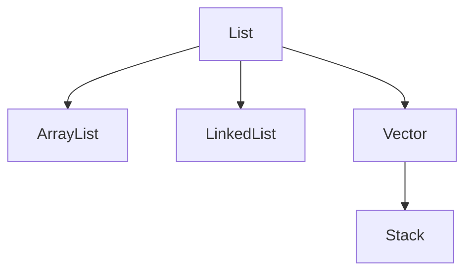

## List

list interface properties
- Elements have a position
- Duplicate are allowed
- Insertion order is preserved
- You can access elements by index(random access may or may not be possible e.g `linkedlist`)
- List is connected to `SequencedCollection` -> instead of directly connected it to `Collection`
### `SequencedCollection interface`
it is a sequence of storing something. methods
- `.getFirst()`
- `.getLast()`
- `.addFirst()`
- `.addLast()`
- `.removeFirst()`
- `.removeLast()`
### `List interface`
as it is list can get element at index and other methods
- `E get(index)` -> even in linked list it work(internally implemented)
- `set(index,E e)` -> replace what ever at index with e(in `linkedList` O(n) and `ArrayList` is O(1))
- `boolean add(index,E e)` -> add it at this index and shift everything to right side(it is O(1) in `linkedList` and O(n) in `ArrayList`) NOTE: this is a overloading of add with has different parameter
- `boolean addAll(index,Collection<? extends E>)` -> similar overload of `addAll` method from collection interface
- `remove(int index)` -> remove at that index(overload of remove which takes E e value instead of index)
- `int indexOf(Object val)` -> index of 1st occurrence of val
- `int lastIndexoOf(Object val)` -> take Object as uses .equals()
- `listIterator()` -> this is specific to list --> has many methods
- `listIterator(int index)` -> start iterator at that index
- `List.of(Collection x)` -> make immutable list 
- `copyOf(Collection x)` -> make a copy of that list
```java
import java.util.*;

public class demo {
    public static void main(String[] args){
        List<Integer> l=new ArrayList<>();
        l.add(1);
        l.add(2);
        l.add(3);
        System.out.println(l.get(1)); // 2
        l.set(1,5);
        System.out.println(l); // [1, 5, 3]
        l.addAll(0,List.of(9,8,7,6));
        System.out.println(l); // [9, 8, 7, 6, 1, 5, 3]
        l.remove(0);
        System.out.println(l); // [8, 7, 6, 1, 5, 3]
        l.add(7);
        System.out.println(l.indexOf(7));     // 1
        System.out.println(l.lastIndexOf(7)); // 6

        ListIterator<Integer> it=l.listIterator();
        while (it.hasNext()) {
            System.out.print(it.next()+" "); // 8 7 6 1 5 3 7 
        }
        System.out.println();
        it=l.listIterator(3);
        while (it.hasPrevious()) {
            System.out.print(it.previous()+" "); // 6 7 8
        }
        System.out.println();
        List<Integer> ll=List.of(1,2,3,4,5,6,7,8); // [1, 2, 3, 4, 5, 6, 7, 8]
        // ll.add(9); // java.lang.UnsupportedOperationException
        List<Integer> l2=List.copyOf(ll);
        // l2.add(9); // java.lang.UnsupportedOperationException
        System.out.println(l2); // 
    }
}
```
## `ArrayList`
It uses dynamic array internally. Java make new capacity by using `new capacity = 1.5*old capacity`
- `.get(index)` -> O(1)
- `.set(index,E e)` -> O(1)
- `.add(index,E e)` -> O(n)
- `.remove(index,E e)` -> O(n)
properties
- Random access 
- Cache friendly thus fast
- simple structure
has 3 constructor 
- `new ArrayList<>()` empty array list
- `new ArrayList<>(10)` initial capacity
- `new ArrayList<>(c)` pass a collection
Array list specific methods
- `.ensureCapacity(int n)` -> make initial this capacity of n(to avoid many time copy to increase size)
- `.trimToSize()` -> removed all un-used capacity of the array list
- `.capacity` and `.size` 
## `LinkedList`
It hold a node class internally 
java use doubly linked list for effective operations
it maintains 2 pointers `first` and `last` which are never moved used `temp`
- `.get(3)` -> O(n) little optimize by using last or first which is close to 3
- `.add(index)` -> O(n) still use same optimization
- `.remove(index)` -> O(n) still use same optimization
this linked list is used to represent queue and stack -> it has special methods for it.
## Vector , stack
This are legacy(before collection frame work) class which are replaced by array list.
this are thread safe thus, have extra overhead thus, slower
for thread safety we have thread safe version of array list and linked list also which are better
and stack is implemented using the `Queue` interface special class `ArrayDeque` doubly ended queue
