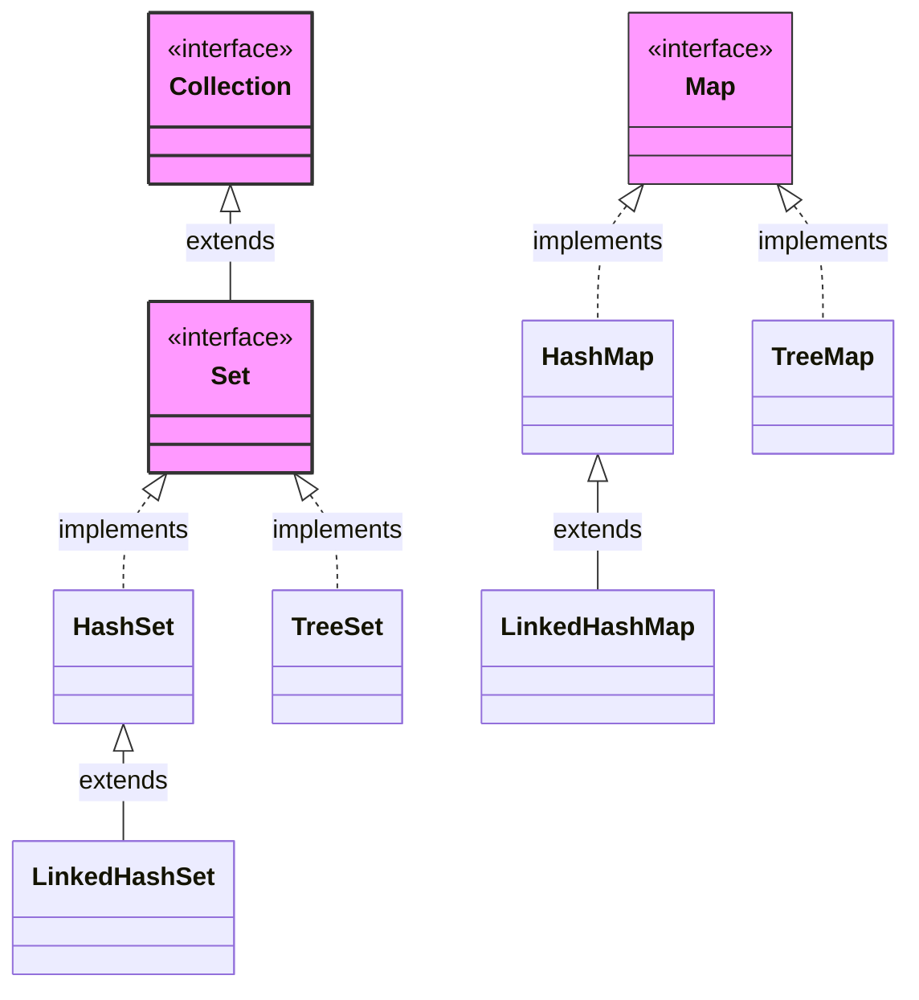
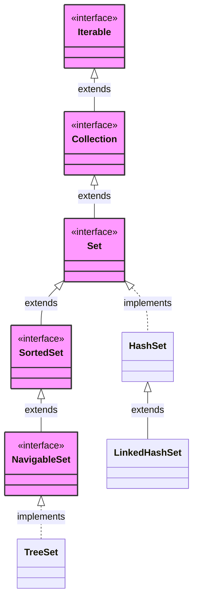

### Set
provides a contract for 
- Duplicates are not allowed
- Constant time search operation O(1)
Used for real world
- find unique
### Map
provides a contract 
- it will store key:value pair
- duplicate key not allowed
- get value at key in O(1) -> constant time search
- `map.containsKey(key)` -> O(1)
example
- roll no : name
- roll no is unique
set and map loss is 
- positional access not found(no order maintained)
```java
import java.util.*;

public class demo {
    public static void main(String[] args) {
        Set<String> s=new HashSet<>();
        s.add("Meow");
        s.add("Cat");
        s.add("Kitty");
        s.add("Cat");
        System.out.println(s); // [Meow, Cat, Kitty]
        System.out.println(s.contains("Cat")); // true
        System.out.println(s.contains("Dog")); // false

        Map<Integer,String> m=new HashMap<>();
        m.put(101,"Meow");
        m.put(102,"Cat");
        m.put(103,"Kitty");
        m.put(103,"Dog"); // update not add
        System.out.println(m); // {101=Meow, 102=Cat, 103=Dog}
        System.out.println(m.get(102)); // Cat
        System.out.println(m.containsKey(103)); // true
    }
}
```
Internal working
- array of buckets -> hashing to get value in constant time. Thus, unique 
- uses modulo(%) and other methods to has negative numbers and methods to avoid collision. like `nD` linked list with so complex logic
- for string, anything can call `.hashCode()` will give integer can be used to hash
- if hash of different value is same then, store it in the linked list at that hash value
- can store multiple in -> thus near/average time complexity O(1)
similarly in map
- can store pair as internal class and hash it like hash primitive datatype.
- hash keys and store values in buckets
## Java internals
There is nothing like `set` in java we have `map` which has all properties of same as `set`
In java, set/map are stored as map
internally set is a map(set value is key in map with dummy values)
- `s.add(2)` converts to `.put(2,PRESENT)` -> present is a `Private static final = new Object();`
- `s.contains(2)` converts to `.containsKey(2)`
has node
```java
class node<K,V>{
	K key;
	V value;
	int hash;
	Node<K,V> next;
}
```
## `HashSet`
- `.add(E e)` -> gives boolean(if duplicate then false)
```java
import java.util.*;

public class demo {
    public static void main(String[] args) {
        Set<String> s=new HashSet<>();
        s.add("Meow");
        boolean a=s.add("Cat");
        s.add("Kitty");
        boolean b=s.add("Cat");
        System.out.println(a+" "+b); // true false
    }
}
```
can add in bucket using % and check in bucket using `.equal()` to return true or false
-> maintain "if `equals()` is same then `.hashCode()` must be same" -> return true if `hashCode` and `equals` both are checked before giving true to contains
Set has no `.get()` methods only has contains method
- Collision in hash methods
	- uses linked list to chaining method(used in java)
	- open addressing(not in java) -> put to places where has place(nearest cell) shifting
### Load Factor
- no of elements at a place -> element by capacity
- if more than 75% filled array(no of element/capacity of hash array)
- does rehashing -> to avoid making long linked list using modulo(%)
- make new hash array of size => double size than previous --> rehashing 
- initial default size is 16 
- Load factor < 0.75(12) ---> false than double it
### Treefication(java 8)
- if at a node size of linked list is 8 elements
- then it convert it to BST(red black binary search tree)
- to convert O(N) -> O(logn)
set in internally uses map
### `LinkedHashSet/LinkedHashMap`
It is normal set and map 
as in general, won't get element will get in order
order of insertion and order of traversal are different(drastically)
Solved by this `LinkedHash` - Solved by using `DoublyLinkedList` to maintain order of traversal using iterator
- 1st linked list -> for hash
- 2nd linked list -> to maintain insertion order
Thus it will have overhead and extends `HashSet/HashMap`
### `TreeHashSet/TreeHashMap`
tree set uses internally uses tree map.
It used red black tree(self balancing tree)
same all operations
disadvantage
- complexity changes from O(1) -> O(logn) for all operation
advantage
- keys sorted printing
- largest / smallest element
- range query 
not uses hashing -> strings saved in lexicographical order to search(compare using BST in O(logn))
### BST
Uses self balancing by changing root(as it may skew to one side if keep adding more nodes) => using red black tree it balances by changing root
```java
class node<K,V>{
	K key;
	V value;
	Node left;
	Node right;
	Node parent;
	boolean color; // can be red or black
}
```
smaller value goes to left and higher goes to right
makes nodes and put BST for keys 
thus, used to implement map and set
it has all parent child keep each other's reference
### buckets
in set and map of `Linked` and `Hash`
- can have 1 key as null
- can have infinite null value(e.g `PRESENT` in set implementation)
but in `tree` type of set and map => uses compare instead of hashCode and 
- uses

## Set
set has no unique methods

```java
import java.util.*;

public class demo {
    public static void main(String[] args) {
        Set<Integer> s = new HashSet<>(); // 16 size bucket
        Set<Integer> s2 = new HashSet<>(100); // 100 size bucket
        Set<Integer> s3 = new HashSet<>(100, 0.5f); // 100 size bucket, load factor
        Set<Integer> s4 = new HashSet<>(List.of(1, 2, 3, 4, 5));
        // all above are same for LinkedHashSet
    }
}
```
Linked and Hash have no new methods => but Tree set have many new methods
#### `SortedSet` Interface
These methods provide basic ordering capabilities, allowing you to get the boundaries or subsets of the sorted collection.
- `E first()` — Returns the first (lowest) element currently in this set.
- `E last()` — Returns the last (highest) element currently in this set.
- `SortedSet<E> headSet(E toElement)` — Returns a view of the portion of this set whose elements are strictly less than `toElement`.
- `SortedSet<E> tailSet(E fromElement)` — Returns a view of the portion of this set whose elements are greater than or equal to `fromElement`.
- `SortedSet<E> subSet(E fromElement, E toElement)` — Returns a view of the portion of this set whose elements range from `fromElement` (inclusive) to `toElement` (exclusive).
```java
import java.util.*;

public class demo {
    public static void main(String[] args) {
        TreeSet<Integer> s1 = new TreeSet<>(); // make treeSet instead of set to get all all new methods of in TreeSet
        TreeSet<Integer> s2 = new TreeSet<>(List.of(1, 2, 3, 4, 5));
        s1.add(81);
        s1.add(23);
        s1.add(8);
        s1.add(90);
        s1.add(50);
        // sortedSet Interface
        System.err.println(s1.first()); // 8  get smallest element
        System.err.println(s1.last()); // 90 get largest element
        System.err.println(s1.headSet(50)); // get all elements which are less than 90 => [8, 23] 
        System.err.println(s1.tailSet(50)); // get all elements which are greater than equal to 50 => [50, 81, 90]
        System.err.println(s1.subSet(10, 30)); // get all elements which are between range [10,30) => [23] 
    }
}
```
#### `NavigableSet` Interface
These methods provide navigation capabilities, letting you search for closest matches or closely bound elements, as well as poll and reverse the set.
### Closest Match Search Methods
- `E lower(E e)` — Returns the greatest element in this set strictly less than the given element, or `null` if there is no such element.
- `E floor(E e)` — Returns the greatest element in this set less than or equal to the given element, or `null` if there is no such element.
- `E ceiling(E e)` — Returns the least element in this set greater than or equal to the given element, or `null` if there is no such element.
- `E higher(E e)` — Returns the least element in this set strictly greater than the given element, or `null` if there is no such element.
### Polling Methods
- `E pollFirst()` — Retrieves and removes the first (lowest) element, or returns `null` if this set is empty.
    
- `E pollLast()` — Retrieves and removes the last (highest) element, or returns `null` if this set is empty.
    

### Iteration & Reverse View Methods

- `NavigableSet<E> descendingSet()` — Returns a reverse-order view of the elements contained in this set.
    
- `Iterator<E> descendingIterator()` — Returns an iterator over the elements in this set, in descending order.
    

### Overloaded Overlapping/Subset Methods (with inclusive flags)

- `NavigableSet<E> headSet(E toElement, boolean inclusive)` — Returns a view of the portion of this set whose elements are less than (or equal to, if `inclusive` is true) `toElement`.
    
- `NavigableSet<E> tailSet(E fromElement, boolean inclusive)` — Returns a view of the portion of this set whose elements are greater than (or equal to, if `inclusive` is true) `fromElement`.
    
- `NavigableSet<E> subSet(E fromElement, boolean fromInclusive, E toElement, boolean toInclusive)` — Returns a view of the portion of this set whose elements range from `fromElement` to `toElement` with customizable boundary inclusivity.
```java
import java.util.*;

public class demo {
    public static void main(String[] args) {
        TreeSet<Integer> s1 = new TreeSet<>();
        TreeSet<Integer> s2 = new TreeSet<>(List.of(1, 2, 3, 4, 5));
        s1.add(81);
        s1.add(23);
        s1.add(8);
        s1.add(90);
        s1.add(50);
        s1.add(60);
        s1.add(80);

        // largest number smaller than 80
        System.out.println(s1.lower(80)); // 60
        // largest number greater than equal to 80
        System.err.println(s1.floor(80)); // 80

        System.err.println(s1.higher(80)); // 81
        System.err.println(s1.ceiling(80)); // 80

        System.out.println(s1.pollFirst()); // 8 -> give smallest element and removes it
        System.out.println(s1.pollFirst()); // 23 
        System.err.println(s1.pollLast());  // 90

        System.err.println(s1); // [50, 60, 80, 81] // default accending
        System.err.println(s1.descendingSet()); // [81, 80, 60, 50]
        Iterator<Integer> it=s1.descendingIterator();
        while(it.hasNext()){
            System.out.print(it.next()+" "); // 81 80 60 50
        }
        System.err.println();

        // head(not inclusive) and tail(inclusive) where 
        // can have inclusive or not inclusive by boolean true or false
        System.err.println(s1.headSet(80,true)); // [50, 60, 80] 
        System.err.println(s1.tailSet(80,false)); // [81] 
        System.err.println(s1.subSet(50,true,80,true)); // [50, 60, 80]
    }
}
```
## Map
similar to set have Linked, Hash, and tree version of map
It is separate from collection interface
it has methods -> `.size()`, `.containKey()`, `.isEmpty()` 
```java
import java.util.*;

public class demo {
    public static void main(String[] args) {
        Map<Integer, String> m = new HashMap<>();
        m.put(101, "Meow");
        m.put(202, "Bow");
        m.put(303, "Jow");

        System.err.println(m.size());    // 3
        System.err.println(m.isEmpty()); // false
        System.err.println(m.get(101));  // Meow
        System.err.println(m.containsKey(303));  // true  -> O(logn) BST
        System.err.println(m.containsValue("Meow"));  // true -> O(n)
        System.err.println(m.put(404, "Mow"));  // null (if new key)
        System.err.println(m.put(404, "Mow1"));  // Mow (existing key changed value return previous value)
        System.err.println(m.get(404));  // Mow1

        System.err.println(m.remove(303));  // Jow
        System.err.println(m.remove(404, "Mow1"));  // true (if key and value matched)

        Map<Integer, String> m1 = new HashMap<>();
        m.putAll(m1); // put all elements from m to m1
        m.clear();
    }
}
```
some map specific methods
```java
import java.util.*;

public class demo {
    public static void main(String[] args) {
        Map<Integer, String> m = new HashMap<>();
        m.put(101, "Meow");
        m.put(202, "Bow");
        m.put(303, "Jow");

        System.out.println(m); // {101=Meow, 202=Bow, 303=Jow}

        System.out.println(m.keySet()); // [101, 202, 303] give set as key are unique
        System.out.println(m.values()); // [Meow, Bow, Jow] values may repeats gives collection
        
        Set<Map.Entry<Integer, String>> s = m.entrySet(); // like pair we have Entry
        System.out.println(s); // [101=Meow, 202=Bow, 303=Jow] 

        // avoid null exception
        System.out.println(m.getOrDefault(404, "Not Found")); // Not Found => if not exists give default
        System.out.println(m.putIfAbsent(101, "wolf")); // Meow => if not exists put it else do nothing and return value
        System.out.println(m.get(101)); // Meow

        System.out.println(m.remove(101)); // Meow => remove 101 key value
        System.out.println(m.remove(202,"Bow")); // true => remove 101 key value (both match then will remove)
        // replace can't create 
        System.out.println(m.replace(303,"Jow")); // Jow => replace 303 key value 
        // safe replace
        System.out.println(m.replace(303,"Jow","Dog")); // true => replace 303 key value 

        Set<Map.Entry<Integer, String>> e = m.entrySet();
        for(Map.Entry<Integer, String> i : e){
            Integer k = i.getKey();
            String v = i.getValue();
            System.out.println(k+" "+v); // 303 Dog
        }

        // have similar to List.of we have Map.of which gives immutable map
        Map<Integer, String> m1 = Map.of(101, "Meow", 202, "Bow", 303, "Jow");
        // m1.put(404, "Not Found"); // java.lang.UnsupportedOperationException
        System.out.println(m1); // {303=Jow, 202=Bow, 101=Meow} 
    }
}
```
## `HashMap` / `LinkedHashMap`
```java
import java.util.*;

public class demo {
    public static void main(String[] args) {
        Map<Integer, String> m1 = new HashMap<>();
        Map<Integer, String> m2 = new HashMap<>(100); // initial capacity
        Map<Integer, String> m3 = new HashMap<>(100,0.5); // initial capacity, load factor
        Map<Integer, String> m4 = new HashMap<>(m1);
        Map<Integer, String> m5 = Map.of(101, "Meow", 202, "Bow", 303, "Jow");
        // similary for linked hashmap
    }
}
```
## `TreeMap`
Similar to Tree set -> slight change for pair of key value
```java
import java.util.*;

public class demo {
    public static void main(String[] args) {
        TreeMap<String, String> map = new TreeMap<>();
        map.put("1", "a");
        map.put("2", "b");
        map.put("3", "c");
        map.put("4", "d");
        System.out.println(map.get("3")); // c

        // self balancing BST made using TreeMap => of key
        System.out.println(map.firstKey()); // 1
        System.out.println(map.lastKey()); // 3
        System.out.println(map.lastKey()); // 3
        System.out.println(map.firstKey()); // 1
        System.out.println(map.containsKey("1")); // true
        System.out.println(map.headMap("2")); // {1=a}
        System.out.println(map.tailMap("2")); // {2=b, 3=c, 4=d}
        System.out.println(map.subMap("2", "4")); // {2=b, 3=c}
        
        System.out.println(map.lowerKey("2")); // 1
        System.out.println(map.lowerEntry("2")); // 1=a
        System.out.println(map.higherKey("2")); // 3
        System.out.println(map.higherEntry("2")); // 3=c
        System.out.println(map.subMap("2", true, "4", false)); // {2=b, 3=c}
        System.out.println(map.subMap("2", true, "4", true)); // {2=b, 3=c, 4=d}
        System.out.println(map.subMap("2", true, "4", false)); // {2=b, 3=c}
        System.out.println(map.subMap("2", false, "4", false)); // {3=c}
        System.out.println(map.subMap("2", false, "4", true)); // {3=c, 4=d}
    }
}
```
##### Other maps
`HashTable` -> legacy class for `hashMap` which is thread safe by default (no used ) has overhead
use `concurrentHashMap` for thread safe map
##### Properties
Specialized map for configuration data extend legacy `hashTable`
```
"user":"admin"
"password":"122"
```
used in spring boot 
##### `WeakHashMap`
rarely used
- cache like behavior
- weak reference (memory management)
##### `IdentityHashMap`
normal map is `equality` based (hash code and equality) => have equality and do % => chaining of linked list
it work on == operator
rare used in graph algorithm -> cycles and topology
#### `EnumMap`
It map whose key is object of enum => optimized for it. using ordinal(used as index to hash)
not used hash techniques and no null keys are allowed
allowed null value
Iteration order is preserved by default
##### `ConcurrentHashMap`
for thread safe hash map.(better optimized(for locking and unlocking) as hash table is overhead)
