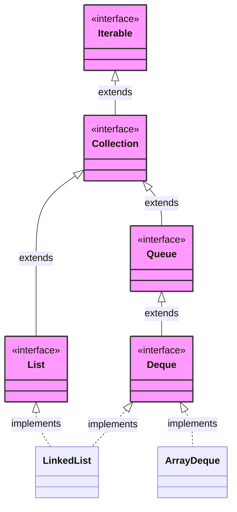
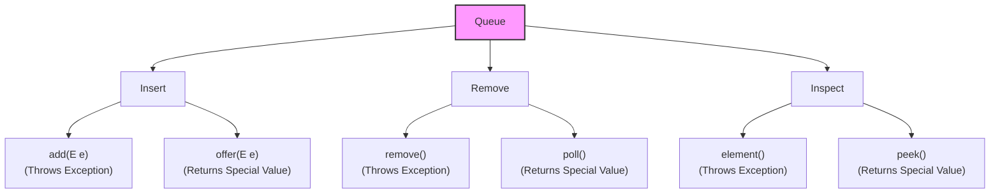
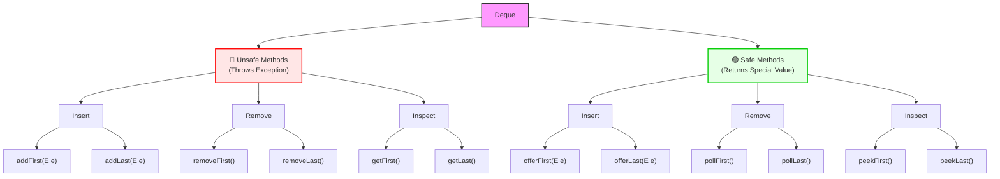
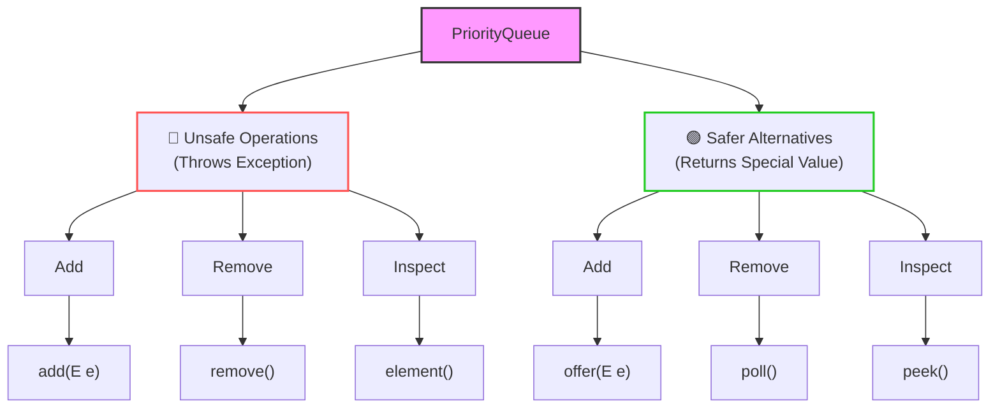

### Queue interface
can use array and linked list => insertion and deletion is O(1)
It is FIFO -> has 2 pointers (front and rear)
`enque(E e)` -> `offer(E e)` return boolean
`dequeue()` -> `poll()` return popped element
In Array implementation
- rear=front=-1
- after initialize
- It is circular(using %n) array if get filled it will be resized => copy previous element 
In linked list implementation
- front and rear=Null
- after initialize front=0
- and free pointer(automatically by garbage collector)
### Stack interface
It has LIFO order
has only 1 pointer top to do `push(E e)` and `pop()`
In Array implementation
- top=-1
In doubly linked list implementation
- top=Null, prev=NULL
- and free pointer(automatically by garbage collector)
- pop => prev->next=NULL
## Deque

`ArrayDeque` -> is a class used as double ended queue
It `LinkedList` is like deque implementation using linked list
To make stack we use `ArrayDeque`-> can be used as stack
for stack use
- `.offerFirst(E e)` and `.pollFirst()` can call as `push()` and `pop()` this are wrapper only on poll and offer method
### Internal implementation
deque interface implemented by both -> `ArrayDeque` and `LinkedList` 
similar implementation
resize by 1.5 * initialSize => used circular queue(%)
there is similar time complexity weather use `ArrayDeque` or `LinkedList` 
According to java docs :- `ArrayDeque` preferred because contiguous thus, cache friendly
- In `ArrayDeque` can't add null
- In `LinkedList` can add null
it is preferred not to put null as it a way to mark no element
methods in queue

Deque has method

 ```java
 import java.util.*;

public class demo {
    public static void main(String[] args) {
        ArrayDeque<Integer> q=new ArrayDeque<>();
        q.push(1);
        q.add(2);   // throw exception if not added
        q.offer(3); // null
        System.out.println(q.peek()); // 1
        q.pop();
        System.out.println(q); // [2, 3]
        q.remove();
        System.out.println(q); // [3]
    }
}
 ```
LIFO and FIFO -> are behavioral contact maintained by developer ----> like not use `remove`
### Priority queue
It is a queue where, element arranged as priority
remove(dequeue) the most priority element if same priority then dequeue by FIFO
default-> smallest has maximum priority
used in 
- scheduling
internally
- it uses heap(binary) data structure => It is complete binary tree implemented using array => it filled from left to right by level can't skip level(all levels are filled from left to right)
- make a array which is made using BST -> fill from left to right and top to bottom
- if parent = i(in array) then, left=2 * i+1 and right=2 * i+2
- may not get sorted array
- it will give smallest element at front
This default is called min-heap
can make it max-heap
- when pop -> make a heapify algo -> to remake the BST and 
	- UP heapify
	- i(parent),2i+1,2i-1
	- swap up(to parent) to maintain BST => this we get minimum element again
	- put in last and do above repeatedly tell no swap required
	- for i -> parent is floor((i-1)/2) => will be parent
	- check(for BST i.e if parent is bigger than child do swap)
	- swap to move up the smallest
- when to pop from 
	- DOWN heapify
	- put front element to end of array (bottom of graph) swap
	- then remove it from last 
	- now for to need to do down heapify
	- see child by 2i+1 and 2i+2 => by swapping more biggest number down
do -> down heapify = poll() remove
	  up heapify = offer(10) add
both are O(logn) time
```java
import java.util.*;

public class demo {
    public static void main(String[] args) {
        // min heap
        PriorityQueue<Integer> pq=new PriorityQueue<>();
        pq.offer(20);
        pq.offer(10);
        pq.offer(40);
        pq.offer(30);
        System.out.println(pq.peek()); // 10
        pq.poll();
        System.out.println(pq.peek()); // 20

        // max heap
        PriorityQueue<Integer> pq1=new PriorityQueue<>((a,b)->b-a); // uses lambda expression
        pq1.offer(20);
        pq1.offer(10);
        pq1.offer(40);
        pq1.offer(30);
        System.out.println(pq1.peek()); // 40
        pq1.poll();
        System.out.println(pq1.peek()); // 30
    }
}
```
It has all methods of queue. 

