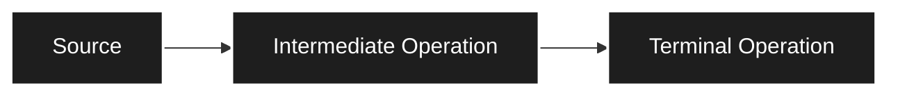
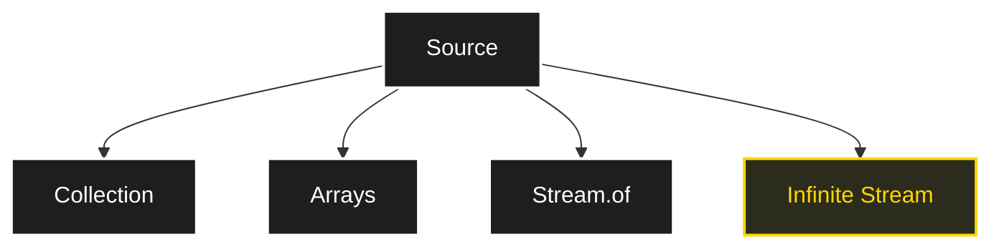
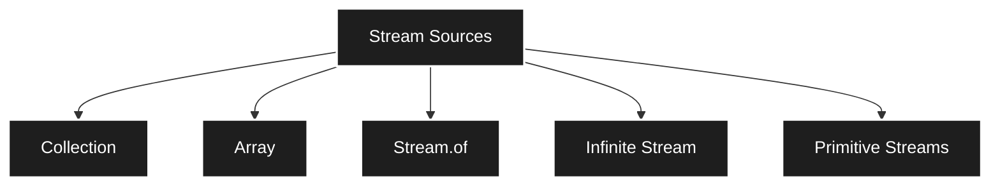
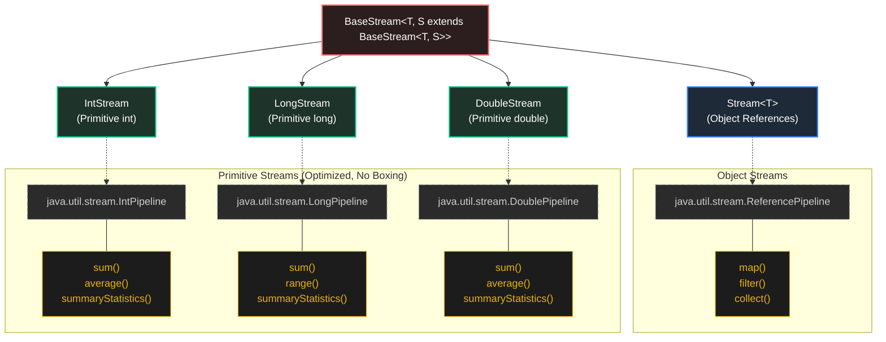
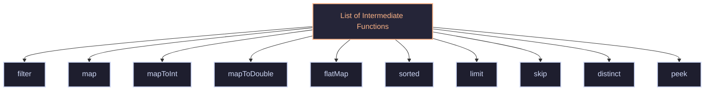
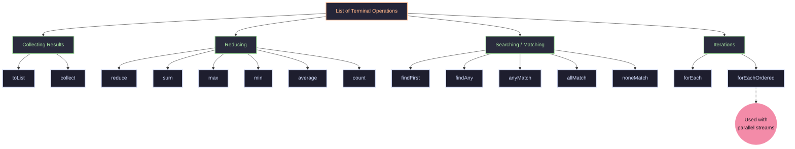
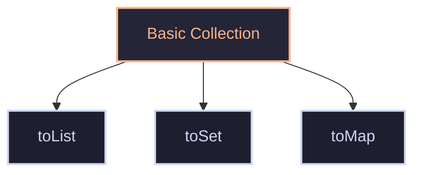

it uses lambdas
### Streams
do operation on a object like pipeline -> do sequence of operations 
normal we do imperative code(mechanics loops), need to make it declarative code(like SQL)
In collection have 
- `Stream()`
- `parallelStream()`
![[Pasted image 20260614152550.png]]
make it functional programming style 
## Streams
A stream is a tool for processing a sequence of data through a chain of operation.
Like water pipeline with may filter
stream -> data processing not collecting data 
stream work on current collection.(no other storage)
-> like connect source of pipe to the list(internally it uses `SplitIterator`)
## Stream pipeline Architecture
It has 3 components

```java
list.strema() // make source to list
	.filter(x->x>10) // below intermidate operation
	.map(x->x+2)
	.tolist(); // terminal operation(finally make a list) IMP
```
how to consume it is to be specified(optimized for it)
### Source
it can be collection ,Array, Stream.of(), infinite stream

when do `list.stream()` => it give a object of `type Stream<T>`
### Intermediate operations
it does some transformation on the stream
there are many methods in it like `.filter(Predicate interface)`,`.map(Function inteface)`,`.sort()` ..., all are methods in Stream Object
all this method return -> Stream Object(so can apply more methods)
it builds pipeline step by step
### Terminal operation
do something to end 
example `.foreach(Consumer)`,`toList()`,`Collect()`,`count()`...
it will return value/void(not a stream)

> [!Note]
> If no terminal operation stream will not be executed it is only declared => unlocks feature of Lazy loading(by design)
> Also Stream once used(taken terminal opertation) is dead

items will filter out as => (the `streamIterator`)=> does the fill transformation and termination -> for each element one by one ====> Vertical processing(one element then other)
if take all element and apply filter one then take remaining and apply filter 2 ... ====> Horizontal processing
Java uses Vertical processing optimized(Lazy evaluation)
Lazy evaluation stops as soon as like `break`(because vertical)
Stream stored -> can use only once(only can consumed once)
```java
import java.util.stream.*;
import java.util.*;

public class demo {
    public static void main(String[] args) {
        List<Integer> list = new ArrayList<>(List.of(1, 2, 3, 4, 5, 6, 7, 8, 9, 10));
        System.out.println(list); // [1, 2, 3, 4, 5, 6, 7, 8, 9, 10]
        Stream<Integer> s = list.stream();
        s.filter(i -> i % 2 == 0).map(x->x*x).forEach(System.out::println);
        // 4 16 36 64 100
    }
}
```
#### Source

there are two types of `l.stream()`,`l.parallelStream()` this parallel stream makes.(parallel processing)
Stream of array
```java
import java.util.stream.*;
import java.util.*;

public class demo {
    public static void main(String[] args) {
        String[] arr = {"a", "b", "c", "d", "e", "f", "g", "h", "i", "j"};
        Stream<String> s=Arrays.stream(arr);
        s.map(x->x.toUpperCase()).forEach(System.out::println);
        // A B C D E F G H I J
    }
}
```
directly 
```java
import java.util.stream.*;
import java.util.*;

public class demo {
    public static void main(String[] args) {
        Stream<Integer> s = Stream.of(1, 2, 3, 4, 5, 6, 7, 8, 9, 10);
        s.filter(x->x==7).forEach(System.out::println); // 7
    }
}
```
can make empty stream using `Stream.empty()` -> where need to avoid null 
Can make infinite stream by using `Stream.iterate(seed,nextFn)`,`Stream.generate(supplier)`
can do `.limit(x)` does next x times
iterate -> depends on previous value
generate -> gets infinity from supplier
if dynamic and data => use infinite stream
as Lazy evaluate thus can make stream (pause till add terminal condition)
#### Primitive stream
use Integer,Double,Long does unboxing and auto boxing thus need primitive for optimization
thus, have `IntStream`,`DoubleStream`,`LongStream` --> more efficient
```java
import java.util.stream.*;
import java.util.*;

public class demo {
    public static void main(String[] args) {
        IntStream s = IntStream.range(1, 10);
        s.filter(x->x==7).forEach(System.out::println); // 7
    }
}
```
Over all stream interface

Stream is vertical load 
can convert between stream type
object to primitive
```java
import java.util.stream.*;
import java.util.*;

public class demo {
    public static void main(String[] args) {
        Stream<Integer> n=Stream.of(1,2,3,4,5,12,3,8,4,92,5,7,7,6,54,3,21,2,345,4,32,12,345,2);
        IntStream s = n.mapToInt(x->x);
        s.filter(x->x==7).forEach(System.out::println); // 7
    }
}
```
primitive to object
```java
import java.util.stream.*;
import java.util.*;

public class demo {
    public static void main(String[] args) {
        IntStream s = IntStream.range(0, 10);
        Stream<Integer> s2 = s.boxed();
        s2.map(i -> i * 2).filter(i -> i % 3 == 0).forEach(System.out::println);
        // 0 6 12 18
    }
}
```
can convert stream between primitive using `mapToLong(x->x)`,`mapToDouble(x->x)`
can image each element passing through this pipeline
### Intermediate function

basic
```java
import java.util.stream.*;
import java.util.*;

public class demo {
    public static void main(String[] args) {
        List<Integer> l=new ArrayList<>(List.of(23,12,3,4));
        l.stream()
            .filter(x->x%2==0) // takes a predicate
            .filter(x->x<20)
            .map(x->x*x)       // takes a function 
            .forEach(System.out::println); // 144 16
    }
}
```
flat map convert {1,{2,3},{4,{5},6},7} -> {1,2,3,4,5,6,7}
```java
import java.util.stream.*;
import java.util.*;

public class demo {
    public static void main(String[] args) {
        List<List<Integer>> l=new ArrayList<>(List.of(List.of(5,1,2),List.of(4,2),List.of(6,7,8)));
        // l.stream()
        //     // .map(x->x*2) // Error: bad operand types for binary operator
        //     .map(x->x.stream().map(y->y*2))
        //     .forEach(System.out::println);
                // java.util.stream.ReferencePipeline$3@7344699f
                // java.util.stream.ReferencePipeline$3@6b95977
                // java.util.stream.ReferencePipeline$3@7e9e5f8a

        l.stream()
            .flatMap(x->x.stream()) // flat it.
            .map(x->x*2)
            .sorted()
            .forEach(System.out::println); 
        // 2 4 6 8 10 12 14 16

    }
}
```
for sorted need all element together thus, will do horizontally instead of vertically
Thus, `.sorted()` is called state-full method
can give comparator -> 
```java
        l.stream()
            .flatMap(x->x.stream()) // flat it.
            .map(x->x*2)
            .sorted((a,b)->b-a)
            .forEach(System.out::println); 
        // 16 14 12 10 8 4 4 2
```
distinct value -> keeps unique value
```java
import java.util.stream.*;
import java.util.*;

public class demo {
    public static void main(String[] args) {
        List<Integer> l=new ArrayList<>(List.of(1,2,2,3,4,5,5,5,6,1,1,5));
        l.stream()
            .map(x->x*x)
            .distinct()
            .forEach(System.out::println); 
        // 1 4 9 16 25 36
    }
}
```
distinct is also state-full
`.limit()` used to handle infinite stream 
```java
import java.util.stream.*;
import java.util.*;

public class demo {
    public static void main(String[] args) {
        Stream.iterate(1, x->x+1)
            .limit(10)
            .forEach(System.out::println); // 1 2 3 4 5 6 7 8 9 10
    }
}
```
`.skip(x)` to skip initial x elements
```java
import java.util.stream.*;
import java.util.*;

public class demo {
    public static void main(String[] args) {
        Stream.iterate(1, x->x+1)
            .skip(5)
            .limit(10)
            .forEach(System.out::println); // 6 7 8 9 10 11 12 13 14 15
        Stream.iterate(1, x->x+1)
            .limit(10)
            .skip(5)
            .forEach(System.out::println); // 6 7 8 9 10
    }
}
```
can check what is happening at a stage `.peek()` which takes a terminator => help debugging
```java
import java.util.stream.*;
import java.util.*;

public class demo {
    public static void main(String[] args) {
        Stream.iterate(1, x->x+1)
            .limit(10)
            .peek(System.out::println) 
            .skip(5)
            .forEach(System.out::println);
        // 1 2 3 4 5 6 6 7 7 8 8 9 9 10 10
    }
}
```
normal stream to primitive stream `.mapToInt()`,`.mapToDouble()`
### Terminal operation
As stream is lazy thus need a terminal to make the steam start(acts as trigger)

`forEachOrder` is same as `forEach` which maintains order in a parallel stream
```java
import java.util.stream.*;
import java.util.*;

public class demo {
    public static void main(String[] args) {
        List<Integer> l=new ArrayList<>(List.of(6,2,7,4,5,1,3));
        l.stream()
            .map(x->x+1)
            .forEach(x->System.out.print(x+"  ")); // 7  3  8  5  6  2  4 
        System.out.println();
    }
}
```
Collecting data using `.toList()`
```java
import java.util.stream.*;
import java.util.*;

public class demo {
    public static void main(String[] args) {
        List<Integer> l=new ArrayList<>(List.of(6,2,7,4,5,1,3));
        List<Integer> l2=l.stream()
            .map(x->x+1)
            .toList();
        // It gives a immutable List
        // l2.add(2); // java.lang.UnsupportedOperationException 
        System.out.println(l2); // [7, 3, 8, 5, 6, 2, 4] 
    }
}
```
`collect()` it uses `Collector` which allows to collect data in different ways
It takes a `Collector` interface, have class `Collectors` which can give any collector
```java
import java.util.stream.*;
import java.util.*;

public class demo {
    public static void main(String[] args) {
        List<Integer> l=new ArrayList<>(List.of(6,2,7,4,5,1,1,2,3));
        List<Integer> l2=l.stream()
            .map(x->x+1)
            .collect(Collectors.toList());
        l2.add(99); // mutable
        System.err.println(l2); // [7, 3, 8, 5, 6, 2, 2, 3, 4, 99]

        Set<Integer> l3=l.stream()
            .map(x->x+1)
            .collect(Collectors.toSet());
        l2.add(99); // mutable
        System.err.println(l3); // [2, 3, 4, 5, 6, 7, 8]
    }
}
```
reducer convert stream to singe value
```java
import java.util.stream.*;
import java.util.*;

public class demo {
    public static void main(String[] args) {
        List<Integer> l=new ArrayList<>(List.of(6,2,7,4,5,1,1,2,3));
        Optional<Integer> sum =l.stream()
            .reduce((a,b)->a+b); // accumate all give optional class
        System.out.println(sum.get()); // 31 
    }
}
```
this `Optional` Class is to avoid null-pointer-exception
```java
import java.util.stream.*;
import java.util.*;

public class demo {
    public static void main(String[] args) {
        List<Integer> l=new ArrayList<>(List.of(6,2,7,4,5,1,1,2,3));

        // reduce()
        Optional<Integer> sum =l.stream()
            .reduce((a,b)->a+b); // accumate all give optional class
        System.out.println(sum.get()); // 31 

        int s =l.stream()
            .reduce(0,(a,b)->a+b); // accumate with base 0(avoid null exception)
        System.out.println(s); // 31 

        int p =l.stream()
            .reduce(1,(a,b)->a*b);
        System.out.println(p); // 10080

        // count()
        long c=l.stream()
            .filter(x->x%2==0)
            .distinct()
            .count();
        System.out.println(c); // 3

        // findFirst() -> shortCkt 
        Optional<Integer> nn=l.stream()
            .filter(x->x%3==0)
            .findFirst();
        System.out.println(nn.get()); // 6

        // findany() ->  bring more freedom in parallel stream
        Optional<Integer> nnn=l.stream()
            .filter(x->x%3==0)
            .findAny();
        System.out.println(nnn.get()); // 6

        // anyMatch() -> takes predicate and true of any
        Boolean b=l.stream()
            .anyMatch(x->x==1);
        System.out.println(b); // true

        // allMatch() -> takes predicate and true of all
        Boolean b1=l.stream()
            .allMatch(x->x%2==0);
        System.out.println(b1); // false

        // noneMatch() -> takes predicate and check false for all
        Boolean b2=l.stream()
            .noneMatch(x->x%2==0);
        System.out.println(b2); // false

        // sum(),average(),max(),min() -> works on primitive stream
        int ss=l.stream()
            .filter(x->x%2==0)
            .mapToInt(x->x)
            .sum();
        System.out.println(ss); // 14
        OptionalInt mx=l.stream() // null avoider
            .filter(x->x%2==0)
            .mapToInt(x->x)
            .max();
        System.out.println(mx.getAsInt()); // 6
        OptionalDouble avg=l.stream() // null avoider
            .filter(x->x%2==0)
            .mapToInt(x->x)
            .average();
        System.out.println(avg.getAsDouble()); // 3.5
    }
}
```
## Collector
.collect expect Collector interface object -> it define how will collect values in something.
Class Collectors gives many collector 

```java
import java.util.stream.*;
import java.util.*;

public class demo {
    public static void main(String[] args) {
        List<Integer> l=new ArrayList<>(List.of(6,2,7,4,5,1,1,2,3));
        List<Integer> l2=l.stream()
            .collect(Collectors.toList());
        System.out.println(l2); // [6, 2, 7, 4, 5, 1, 1, 2, 3]

        Set<Integer> s2=l.stream()
            .collect(Collectors.toSet());
        System.out.println(s2); // [1, 2, 3, 4, 5, 6, 7]

        // it will map
        List<String> s=new ArrayList<>(List.of("a","bb","ccc","dddd"));
        Map<Integer,String> mp=s.stream()
            .collect(Collectors.toMap(x->x.length(),x->x));
        System.out.println(mp); // {1=a, 2=bb, 3=ccc, 4=dddd}
    }
}
```
grouping
```java
import java.util.stream.*;
import java.util.*;

public class demo {
    public static void main(String[] args) {
        List<String> s=new ArrayList<>(List.of("a","bb","ccc","dddd","e","ff","ggg"));
        Map<Integer,List<String>> mp=s.stream()
            .collect(Collectors.groupingBy(x->x.length()));
        System.out.println(mp); // {1=[a, e], 2=[bb, ff], 3=[ccc, ggg], 4=[dddd]}
    }
}

// groupingBy() <-- it groups by some key(like property)
```
This is very helpful when making groups of elements with similar property
Special case of `groupingBy` is `partitioningby` it make only 2 group base on condition like odd/even (no 3rd possiblity)
```java
import java.util.ArrayList;

import java.util.stream.*;
import java.util.*;

public class demo {
    public static void main(String[] args) {
        List<Integer> l=new ArrayList<>(List.of(1,2,3,4,5,6,7,7));
        Map<Boolean,List<Integer>> mp=l.stream()
            .collect(Collectors.partitioningBy(x->x%2==0));
        System.out.println(mp); // {false=[1, 3, 5, 7, 7], true=[2, 4, 6]}
    }
}
```
grouping and mapping(takes 2= function map and collector)
```java
import java.util.stream.*;
import java.util.*;

public class demo {
    public static void main(String[] args) {
        List<String> s=new ArrayList<>(List.of("a","bb","ccc","dddd","e","ff","ggg"));
        Map<Integer,List<String>> mp=s.stream()
            .collect(Collectors.groupingBy(
                        x->x.length(),
                        Collectors.mapping(x->x.toUpperCase(),Collectors.toList())
                        ));
        System.out.println(mp); // {1=[A, E], 2=[BB, FF], 3=[CCC, GGG], 4=[DDDD]}
    }
}
```
also can use joining
```java
import java.util.stream.*;
import java.util.*;

public class demo {
    public static void main(String[] args) {
        List<String> s=new ArrayList<>(List.of("a","bb","ccc","dddd","e","ff","ggg"));
        String nn=s.stream()
            .collect(Collectors.joining("-"));
        System.out.println(nn); // a-bb-ccc-dddd-e-ff-ggg

    }
}
```
