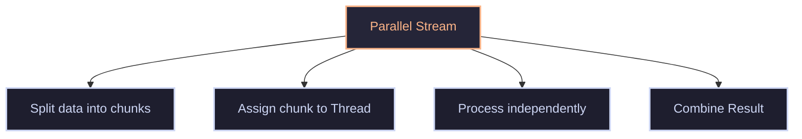

parallel stream works on non-state-full operation(independent data), thus can do task in parallel
```java
import java.util.*;

public class demo {
    public static void main(String[] args) {
        List<Integer> l = new ArrayList<Integer>(List.of(1,2,3,4,5));

        // sequencial stream => vertical processing (slow)
        l.stream().map(x->x*2).forEach(System.out::println); // 2 4 6 8 10

        // parallel stream using thread => pass together many elements
        l.parallelStream().map(x->x*2).forEach(System.out::println); // 6 2 8 10 4
        // order is not maintained => racing

        l.parallelStream().map(x->x*2).forEachOrdered(System.out::println); // 2 4 6 8 10
    }
}
```
There is a performance advantage with `parallelStream` 
It is still vertical processing
#### Parallel stream

It select optimal chuck internal code(logic for thread is java decided).
It is better than O(n). slightly
##### `SplitIterator`
has 3 methods -> `.hasNext()`,`.next()`,`.remove()` => it is performing split internally to work well with parallel stream
Job 
- Traverse the element 
- Decompose source into parts(for normal stream 1 part and for parallel stream n(no of thread allocated) part)
- recursive division of source in half
- Describe the source(like order,indexed,sorted size ...) to optimize looping (biggest advantage over normal iterator)
Methods
- `tryAdvance()` -> responsible for traversal(get next element)
- `trySplit()` -> try to split data set(can't always splits) => not always can do parallel
example 
```java
list.parallelStream()
    .filter(x -> x > 10)
    .map(x -> x * 2)
    .sorted()
    .distinct()
    .forEach(System.out::println);
```
here, sort and distinct -> state function(need to wait) thus, parallel is not effective
Thus, will do fork(split) and joining(intermediate joining)
Thus, has not always better may get overhead(slow down)
Splitting depends on 
- size of data
- complexity of problem
- thread availability
When parallel stream can help ?
- data set is huge(millions)
- CPU intensive work(as CPU has multiple cores)
- states less operation more/major
- optimized data structure for parallel stream(e.g `Array` ,`ArrayList`) (have random access(easy to split))
When not to use parallel stream
- data small (overhead>>performance)
- state-full operation major
#### Shared mutable resource
```java
List<Integer> list;
List<Integer> result;

list.stream()
    // _____
    // _____
    .forEach(x -> result.add(x));
```
problem
- works well with parallel stream
- parallel stream -> multiple thread may race for same position 
- Thus, data loss
## Optional primitive class
[[27.Optional class]]
to avoid unboxing and auto-boxing overhead -> use primitive
Primitive optional class `OptionalInt`,`OptionalDouble`,`OptionalLong` -> used for methods like min ,max, average return primitive optional
`num.getAsInt()` -> to get value ...
rest all same `.isPresent` ...
