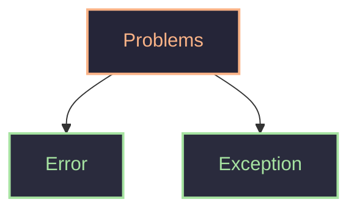
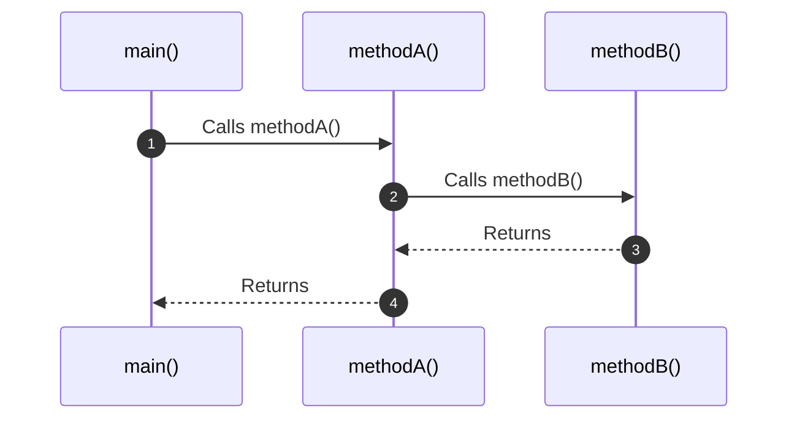
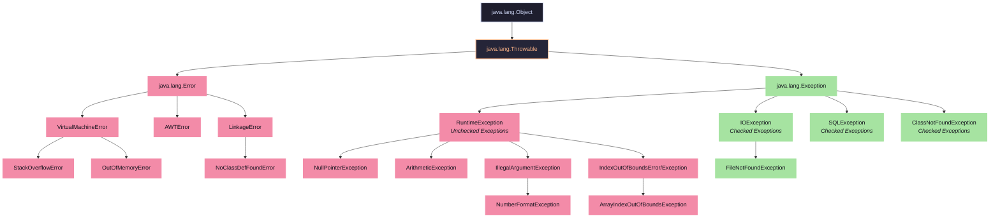

> [!abstract]
> Handle error before they occur, things won't work as per plan (divide by zero,file not found,module not found,syntax error)

As programmer and user are not perfect -> problems

#### Exception
It is a recoverable/handle-able  abnormal condition that occurs during program execution.
it is problem in flow of control 
example
- a/0 : arithmetic exception ----> fix by condition
- file not found : check to fix
#### Error(Object)
are serous problem. 
example
- `outOfMemoryError` => heap memory full
- `StackOverflowError` => stack memory full
### Problems
```java
public class demo {
    public static void main(String[] args) {
        int num = 5/0; // java.lang.ArithmeticException
        System.out.println(num);
    }
}
```
it is object
```java
public class demo {
    public static void main(String[] args) {
        main(args); // java.lang.StackOverflowError
    }
}
```
it is also object
As java is run by JVM => interpreted can 
```java
public class demo {
    public static void main(String[] args) {
        int a = 5;
        int b = 0;

        System.out.println("Step 1"); // Step 1

        System.out.println(a/b); // java.lang.ArithmeticException

        System.out.println("Step 2"); // not executed
    }
}
```
thus should handle this exception
can handle by if-else ----> not exact way
```java
public class demo {
    public static void main(String[] args) {
        int a = 5;
        int b = 0;

        System.out.println("Step 1"); // Step 1
        if(b!=0){ // preventive measure (gracefull handling)
            System.out.println(a/b);
        }
        System.out.println("Step 2"); // Step 2
    }
}
```
if not handle, 
-  JVM decides, and stops
if handle exception
- flow of control is decide
- debugging easy
- user experience better
##### Internally
JVM throws object and message
```java
JVM: new ArithmaticException("divide by zero")
```
throw message -> stops code
it will go to see if exception handle else
stop program and show error  -> default exceptional handling
call stack -> 

JVM calls main method
if exception happens it check if any one handle it 
make object of exception try to throw error 
if A handle, then if B handle 
it will print `stack Trace`
for a/0 
```java
Exception in thread "main" java.lang.ArithmeticException: / by zero
	at demo.main(demo.java:5)
```
can know in which thread exception 
message is `/ by zero`
at where exception occurred and line number
example
```java
public class demo {
    public static void main(String[] args) {
        int a = 5;
        int b = 0;
        System.out.println(method1(a, b));
    }
    public static int method1(int a, int b) {
        return method2(a, b);
    }
    public static int method2(int a, int b) {
        return a/b;
    }
}
```
exception is
```java
Exception in thread "main" java.lang.ArithmeticException: / by zero
	at demo.method2(demo.java:11)
	at demo.method1(demo.java:8)
	at demo.main(demo.java:5)
```
this is default way of exception handling in java
## Manual exception handling
our goal is 
- when an exception occurs, don't crash handle it & continue
It use try catch 
```java
try{
	// risky code
}catch(Exception e){ // here error gives exception 
	// what to do when exception codes
	// preventive measures
}
```
can handle error
```java
public class demo {
    public static void main(String[] args) {
        int a=5;
        int b=0;
        System.out.println("Step 1"); // Step 1
        try {
            System.out.println(a/b);
        } catch (ArithmeticException e) {
            System.out.println("Can't divide by zero"); // Can't divide by zero
        }
        System.out.println("Step 2"); // Step 2
    }
}
```
it check stack -> for handling here, got a handler in main only
```java
public class demo {
    public static void main(String[] args) {
        int a = 5;
        int b = 0;
        System.out.println("Step 1");
        try {
            System.out.println(method1(a, b));
        } catch (Exception e) {
            System.out.println("Exception: " + e);
        }
        System.out.println("Step 5"); 
    }
    public static int method1(int a, int b) {
        System.out.println("Step 3");
        return method2(a, b);
    }
    public static int method2(int a, int b) {
        System.out.println("Step 4");
        return a/b;
    }
}
/* O/P;
Step 1
Step 3
Step 4
Exception: java.lang.ArithmeticException: / by zero
Step 5
*/
```
but exception handle in main => but, generally need should handle it as close where do risk (like at division)
proof of stack trace
```java
public class demo {
    public static void main(String[] args) {
        int a = 5;
        int b = 0;
        System.out.println("Step 1");
        try {
            method1(a, b);
        } catch (Exception e) {
            System.out.println("Exception: " + e);
        }
        System.out.println("Step 5"); 
    }
    public static void method1(int a, int b) {
        System.out.println("Step 3");
        method2(a, b);
    }
    public static void method2(int a, int b) {
        System.out.println("Step 4");
        System.out.println(a/b);
        System.out.println("Step 6"); // never runs as not handled
    }
}
/* O/P;
Step 1
Step 3
Step 4
Exception: java.lang.ArithmeticException: / by zero
Step 5
*/
```
after exception line is un reach to print "Step 6"
this exception object has many methods like `.fillInStackTrace()`,`getCause()`,`getClass`,`getMessage()`,`printStackTrace()` etc
and can put this thing in log file to debug it.

| try catch handling               | if else prevention                |
| -------------------------------- | --------------------------------- |
| intention is to handle exception | intention is to prevent exception |
also have finally block
- which run if run anyway(always). if exception comes or not
- because try runs till exception comes after it it look for catch
- use for clean up => like have transaction open then close it in finally -> close resource log things
can handle 
- `catch(Exception e)` -> general all exception handle
- `catch(NullPointerException e)` -> particular null pointer exception is only handled
thus can write multiple catch
```java
        try {
            method1(a, b);
        } catch (NullPointerException e) {
            System.out.println("null pointer exception");
        } catch (ArithmeticException e) {
            e.printStackTrace();
        } catch (Exception e) {
            System.out.println("Unknow error");
        } finally {
            System.out.println("Finally over");
        }
```
can have 0 or more catch, and can have only 1 finally 
# Nested try catch
```java
try{
	try{
	}catch(){
	}
}catch(){
}
```
cases
- exception will be handled by the closed inner try catch. (i.e exception of inner try will be handled by its own catch if possible)
```java
public class demo {
    public static void main(String[] args) {
        try {
            System.out.println("Outter start"); // Outter start
            try {
                System.out.println("Inner start"); // Inner start
                System.out.println(1/0);  // new ArithmeticException("/ by zero")
                System.out.println("Inner end"); // not reached
            } catch (Exception e) {
                System.out.println("Divide by zero, not allowed"); // Divide by zero, not allowed
            }
            System.out.println("Outter end"); // Outter end
        } catch (ArithmeticException e) {
            System.out.println("Divide by zero, not allowed"); // not reached
        }
    }
}
```
can also do nesting in catch block 
> [!important]
> Avoid using nested try-catch as, it will make the code complex

### Hierarchy of Exception handling
There is a `Throwable` class

all methods come from Throw-able class and Exception class and all its sub-classes inherit these methods.
- `.getMessage()`
- `.printStackTrace()`
- `.toString()`
##### Illegal argument exception
Here, illegal-argument-exception => number-forbidden-exception when pass a number which is not convertible. => `Integer.parseInt(s)` / `Thread.sleep(-1200)`
##### Illegal state exception
we can do operation on iterator => `it.remove()` it is at state where it is not pointing at any element
##### class cast exception
when casting wrong types
> [!note]
> Runtime exception are not shown at compile time and will show it at runtime(break code and print stack trace)

checked exception -> compiler say to handle it
```java
public class demo {
    public static void main(String[] args) {
        try {
            System.out.println(10 / 0);
        } catch (Throwable e) { // this dangerous
            System.out.println(e.getMessage()); // / by zero
        }
    }
}
```
at max should write `Exception e` as `Throwable` are also error but, we should not handle error
so handle from specific to general
```java
public class demo {
    public static void main(String[] args) {
        try {
            System.out.println(10 / 0);
        } catch (Exception e) {
            System.out.println(e.getMessage()); // error: exception ArithmeticException has already been caught
        } catch(ArithmeticException e) {
            System.out.println("Divide by zero");
        }
    }
}
```
can do or for sibling exception
```java
public class demo {
    public static void main(String[] args) {
        try {
            System.out.println(10 / 0);
        } catch (ArithmeticException|NullPointerException e) {
            System.out.println(e.getMessage()); // / by zero
        }
    }
}
```
#### Throw and Throws
throw : to throw exception custom
throws : in method signature to tell compiler which exception this method can throw
exception is way to community something is wrong => not to console log 
```java
public class demo {
    private static void checkeligibility(int age){
        if(age<=0){
            throw new IllegalArgumentException("invalid age");
        }else if(age>=18){
            System.out.println("vote");
        }else{
            System.out.println("no vote");
        }
    }
    public static void main(String[] args) {
        checkeligibility(17); // no vote
        checkeligibility(18); // vote
        try {
            checkeligibility(-10); 
        } catch (IllegalArgumentException e) {
            System.out.println(e.getMessage()); // invalid age
        }
    }
}
```
can handle exception
```java
public class demo {
    private static void checkeligibility(int age){
        try {
            if(age<=0){
                throw new IllegalArgumentException("invalid age");
            }else if(age>=18){
                System.out.println("vote");
            }else{
                System.out.println("no vote");
            }
        } catch (Exception e) {
            System.out.println(e.getMessage());
        }
    }
    public static void main(String[] args) {
        checkeligibility(17); // no vote
        checkeligibility(18); // vote
        checkeligibility(-10); // invalid age
    }
}
```
but caller won't know => so only throw exception caller will handle them
#### Throws
it is used in checked exceptions
```java
import java.io.*;

public class demo {
    public static void main(String[] args) {
        FileReader fr = new FileReader("abc.txt"); // error: unreported exception FileNotFoundException
    }
}
```
there is a need to handle file not found
```java
import java.io.*;

public class demo {
    public static void main(String[] args) {
        readFile(); // file not found
    }
    public static void readFile() {
        try {
            FileReader fr = new FileReader("abc.txt"); // works fine
        } catch (Exception e) {
            System.out.println("file not found");
        }
    }
}
```
problem: here, caller won't know 
now to indicate a method may throw a exception use keyword throws
then, caller has to handle it or gets error
```java
import java.io.*;

public class demo {
    public static void main(String[] args) {
        // readFile(); // unreported exception FileNotFoundException
        try {
            readFile();
        } catch (FileNotFoundException e) {
            System.out.println(e.getMessage()); // abc.txt (No such file or directory)
        }
    }
    public static void readFile() throws FileNotFoundException {
            FileReader fr = new FileReader("abc.txt");
    }
}
```
throws make a checked exception so caller has to check for it.
```java
import java.io.*;

public class demo {
    public static void main(String[] args) throws FileNotFoundException{
        readFile(); // thread "main" java.io.FileNotFoundException: abc.txt (No such file or directory)
    }
    public static void readFile() throws FileNotFoundException {
            FileReader fr = new FileReader("abc.txt");
    }
}
/*
Exception in thread "main" java.io.FileNotFoundException: abc.txt (No such file or directory)
	at java.base/java.io.FileInputStream.open0(Native Method)
	at java.base/java.io.FileInputStream.open(FileInputStream.java:185)
	at java.base/java.io.FileInputStream.<init>(FileInputStream.java:139)
	at java.base/java.io.FileInputStream.<init>(FileInputStream.java:109)
	at java.base/java.io.FileReader.<init>(FileReader.java:60)
	at demo.readFile(demo.java:8)
	at demo.main(demo.java:5)
*/
```
long trace as java internal are inheritance
> [!info]
> Don't use throws in main as it will goes to console, handle it.

## Custom exception
to handle logic name of exception => for easy of debug and readability
- if user try to withdraw more than balance instead of `illegalargument` exception throw `InSufficientBalance` exception
make a class extend Exception
```java
class InvalidAgeException extends Exception{
	public InvalidAgeException(String msg){
		super(msg);
	}
}
```
this like label to predefined exception class
> [!error]
> Now getting error because we are extending Exception class directly hence Java treats our custom exception class as checked Exception.To make it unchecked we can extend RunTimeException

```java
import java.io.*;

public class demo {
    public static void main(String[] args){
        try {
            checkAge(-1);
        } catch (Exception e) {
            System.out.println(e); // InvalidAgeException: Age cannot be negative
        }
    }
    public static void checkAge(int age) throws InvalidAgeException{
        if(age<0) throw new InvalidAgeException("Age cannot be negative");
        else System.out.println("Valid age");
    }
}
class InvalidAgeException extends Exception{
    public InvalidAgeException(String msg){
        super(msg);
    }
}
```
can make it more specific exception
```java
import java.io.*;

public class demo {
    public static void main(String[] args){
        try {
            checkAge(-1);
        } catch (Exception e) {
            System.out.println(e); // InvalidAgeException: Age cannot be negative
            System.out.println(e.getMessage()); // Age cannot be negative
            System.out.println(e.getAge()); // -1
        }
    }
    public static void checkAge(int age) throws InvalidAgeException{
        if(age<0) throw new InvalidAgeException("Age cannot be negative",age);
        else System.out.println("Valid age");
    }
}
class InvalidAgeException extends Exception{
    private int age;
    public InvalidAgeException(String msg,int age){
        super(msg);
        this.age=age;
    }
    public int getAge(){
        return age;
    }
}
```
### try-with-resources
Resources: any object in java, which is to be closed after use is a resource. (file,db connection,network socket)
close all resource in `finally` block(may forget to do it)
can directly do 
```java
try(FileReader fr=new FileReader("Hek.wk")){
}catch(FileNotFoundException e){
}
```
this will auto close that passed resource
