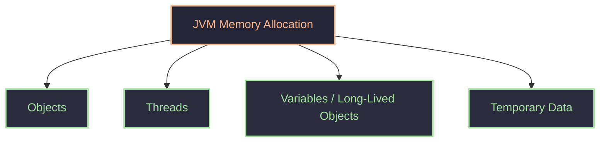
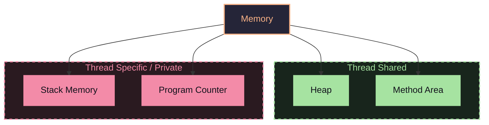
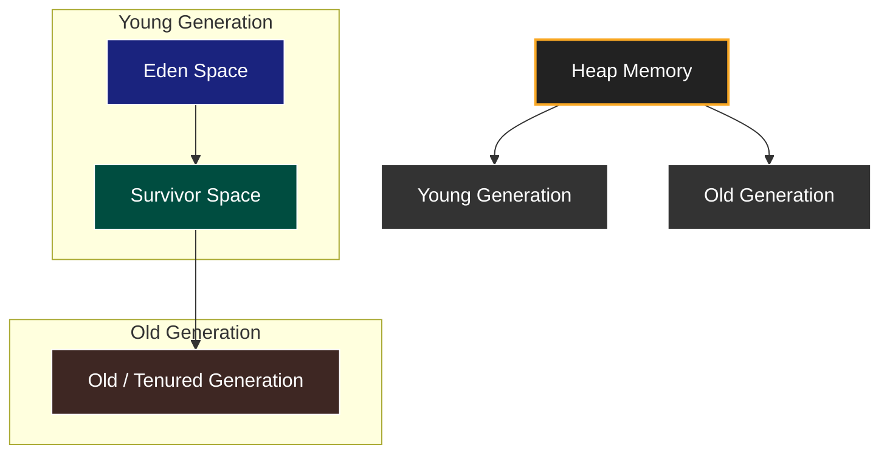

#### Memory management
need memory to store objects ,variables ,class metadata.
Way to JVM interact
- Memory allocation
- Memory use/update
- Memory de-allocate/Free
In C/C++ we have manual memory management in heap.
this is error prone => heap overflow/use-after-free, Solution is Garbage collection by JVM.
###### If have Garbage collector, why learn memory management?
- because need optimize code.
- if a reference variable is still pointing, garbage collector will not erase it.
- need to clear it immediately can't wait for garbage collector.(`OutOfMemoryError`,`StackOverflowError`)
- for performance.

#### Types of memory 

There is also `Native method stack` which helpful when java interacts with other language
- heap and method area -> is thread share(need to do locking)
- dynamic in nature can give maximum and minimum size
- while running do `-Xms2m (minimum space)` and `-Xmx4m (max space)` in MB
```java
import java.util.*;

public class demo{
    public static void main(String[] args){
        List<int[]> l=new ArgumentList<>();
        int count=0;
        while (true) {
            l.add(new int[250000]); // 1M bytes --> 1MB
            count++;
            System.err.println("Allocated "+count+" MB");
        }
    }
}
```
![[Pasted image 20260620160838.png]]
![[Pasted image 20260620160941.png]]
actually it is 1024 => thus went to 5th block
- managed by garbage collection 
- it is slower that stack as overhead of garbage collection
collector free if no reference to it in stack.(object when unreachable)
```java
Student s=new Student();
s=null; // made s eligble for garbage collection
```
or else if it happens in a methods so after return it is destroyed
- object are linked together thus will have graph like => this object can store reference to each other
##### Heap memory
It is a huge chunk of memory where objects are stored at runtime(dynamic memory).
Garbage collector works here only.
life time of objects is unpredictable => not like method to destroy after method call.
what goes in heap
- all objects
- instance variables(not instance or static methods as it is in method area)
- arrays
- string -> can go normally or in string pool
Properties of heap
- shared across thread -> need locking mechanism
###### Parts of heap memory

there are 2 survivor space (S0,S1) 
there is also a string pool in heap which is completely different
```java
Student s=new Student();
```
data first goes to Eden space(here, allocation is fastest) => here, only most of object die(cleaned) as most of object created are short lived
as object becomes old(once garbage collection range) it moves from Eden to S0 then S1 then S0 then S1. => this transfer happen after every cycle of garbage collector
after like 15 cycles from S0->S1->S0... then object is promoted to old generation space.(will have age counter with all object)
Old generation is hard to de-reference JVM sure, this object are long lived.
Thus, garbage collector runs more in young generation than old generation. (optimization to run less garbage collection)
- Young generation : minor garbage collector(GC)
- After 1st GC moves survivors to next level(increment age counter)
- After 15th GC object moves to old generation
- Old generation : major garbage collector(GC) => run very less frequently
as for old object more mapped -> expensive to run GC thus, less frequently run
- Thus number 15 can be optimized based on overflow in survivor
- Dynamic age determination => if many object together go from 1 -> .. -> 5 thus, means have purpose so may directly move to old generation
- Large object -> directly move to old generation(as less size of young generation)
##### Method area
It store meta-data/blue-print of class.
all information about a class -> methods 
all info to make a object of a class
all instance and static method are stored here. methods of a class are never stored in heap
##### Stack memory
also called as function call stack.
It follows LIFO, it is execution memory.
from here, stack trace is print.
It stores frame of methods running

```mermaid
graph BT
    %% Representing the stack structure where new frames sit on top
    subgraph StackMemory [Thread Stack]
        Frame1["... older stack frames ..."]
        Frame2["main() frame"]
        Frame3["methodA() frame"]
        ActiveFrame["min() frame <br><b>[Active Frame]</b>"]
        
        Frame1 --> Frame2
        Frame2 --> Frame3
        Frame3 --> ActiveFrame
    end

    %% Styling for high-contrast scannability
    classDef default fill:#1e1e2e,stroke:#cdd6f4,stroke-width:2px,color:#cdd6f4;
    classDef active fill:#f38ba8,stroke:#f38ba8,stroke-width:2px,color:#11111b;
    classDef standard fill:#2a2b3d,stroke:#fab387,stroke-width:2px,color:#fab387;
    
    class ActiveFrame active;
    class Frame2,Frame3 standard;
    style StackMemory fill:#181825,stroke:#cdd6f4,stroke-width:2px;
```

in one stack frame has
- all local variable(parameter)
- reference variables
- return address
why need return address if we have stack which uses LIFO?
- It stores line number of that method
- below is the method frame with local frame => it tells what state to resume from not location to resume
- exactly it stores program counter(exactly where to continue)
```java
public class demo{
	psvm(){
		int a=10;
		int res=add(a,20);
	}
	int add(int x,int y){
		int sum=x+y;
		return sum;
	}
}
```
stack

```mermaid
graph LR
    subgraph MainFrame [main Stack Frame]
        direction TB
        subgraph MainLVT [Local Variable Array]
            m0["Index 0: args reference"]
            m1["Index 1 (a): 10"]
            m2["Index 2 (res): [Waiting]"]
        end
    end
    style MainFrame fill:#181825,stroke:#fab387,stroke-width:2px;
    style MainLVT fill:#1e1e2e,stroke:#cdd6f4;
```

```mermaid
graph BT
    subgraph Stack [JVM Thread Stack Memory]
        direction BT
        
        subgraph MainFrame [main Frame - Suspended]
            m1["Index 1 (a): 10"]
        end

        subgraph AddFrame [add Frame - Active]
            direction TB
            subgraph AddLVT [Local Variable Array]
                a0["Index 0: this reference"]
                a1["Index 1 (x): 10"]
                a2["Index 2 (y): 20"]
                a3["Index 3 (sum): [Allocating]"]
            end
        end

        MainFrame --> AddFrame
    end

    %% Visualizing the Value Copy
    m1 -. "Value Copied<br/>(Pass-by-Value)" .-> a1

    classDef default fill:#1e1e2e,stroke:#cdd6f4,stroke-width:2px,color:#cdd6f4;
    classDef active fill:#f38ba8,stroke:#f38ba8,stroke-width:2px,color:#11111b;
    classDef mainStyle fill:#2a2b3d,stroke:#fab387,stroke-width:2px,color:#fab387;
    
    class AddFrame active;
    class MainFrame mainStyle;
    style Stack fill:#11111b,stroke:#cdd6f4;
```

```mermaid
graph LR
    subgraph ThreadReg [Thread Return Area]
        R["Return Value Register: 30"]
    end

    subgraph MainFrameAfter [main Frame - Resumed Active]
        m1_a["Index 1 (a): 10"]
        m2_a["Index 2 (res): 30"]
    end

    R -. "Assigns output" .-> m2_a
    style MainFrameAfter fill:#181825,stroke:#fab387,stroke-width:2px;
```



observation
- Grows and shrinks automatically
- memory is auto cleaned(destroy local variable after return)
- It follows LIFO order
why not store in heap
- because stack is fast
- push and pop are O(1)
- very optimized
`StackOverFlow` Error => it occurs when limit excites of stack space(example recursion with out base case)
##### Program counter(PC)
It stores current instruction address which is executing.

```java
public class demo{
	psvm(){
		int x=5;
		Student s=new Student();
		s.name="moe";
	}
}
```
it works steps
- JVM start -> class loader(in method area) store method name it's method it's signature/metadata(inheritance,extend) for demo,Student class
- create main thread -> create it's stack memory and program counter
- it call main method => but main method frame in stack memory(store local variable int x,s all undefined)
- store 5 in x(as there, has memory in stack for it) for s it stores only pointer not full object
- now make a heap memory for Student class
- s will store pointer to this object created in heap memory
- s.name goes to heap for name which points to string pool(which is part of heap) for it.
- after use s will be free to de-allocate when garbage collector runs.
### Example
```java
class Student {
    String name;
    int age;
    static String college = "IIT G";

    public Student(String name, int age) {
        this.name = name;
        this.age = age;
    }

    // Instance method (normal method)
    public void markAttendance() {
        System.out.println(name + " is present");
    }

    // Static method
    public static void changeCollege(String newCollege) {
        college = newCollege;
    }
}

public class Main {
    public static void main(String[] args) {
        Student s1 = new Student("Aditya", 28);

        s1.markAttendance();

        Student.changeCollege("IIT Bombay");
    }
}
```
Doing memory analysis for this program
- compile make demo.class
- JVM start to run demo.class
- load main class --> goes to method area![[Pasted image 20260621161158.png|197]]
- JVM creates main thread and gets program counter (PC) and stack
- load main in stack ![[Pasted image 20260621161526.png]]
- load main in PC of main thread
- execute main and PC points at this lines
- `Student s=new Student()` -> load class Student in method area![[Pasted image 20260621161724.png]]
- now using method are make a object in heap memory
- String is stored in heap string pool
- make entry of constructor in stack frame also have this in it![[Pasted image 20260621162111.png]] as method is stored in method area not in heap with object thus need reference to current object (static method don't have this reference but instance methods have it)
- string will not be stored only it's reference is stored from string pool![[Pasted image 20260621162525.png]] local variable and object instance variable points to same string in string pool
- after creation constructor pop -> `s1` points at this object in heap
- `s1.markattendance` it call method from method area and put on stack 
> [!note]
> PC is changing every step not show to avoid clutter
- Static method is called from class signature from method area(will not have this) 
- string pool stuff happens and reference of college static variable is changed
- comes back to main -> program ends as stack space is now empty
#### Types of references
`Student s=new Student()` => this is called as strong references.
there are 4 types -> decreasing order of strength from GC
- Strong reference (strong)
- Soft reference
- Weak reference
- Phantom reference (almost remove by GC, it is only used by GC internally) => always gives null
as pointing new Student in heap by s -> strong reference(can't remove)
`SoftReference<Student> s1=new SoftReference<>()`it is similar to normal this, will be kept in heap till there is no need more memory => if near overflow this will be the first to be removed(no care if pointing at it or not)
`s1.get()` -> return object if not removed yet
```java
import java.util.*;
import java.lang.ref.SoftReference;

public class demo {
    public static void main(String[] args) {
        List<SoftReference<int[]>> list = new ArrayList<>();
        int count = 0;
        
        try {
            while (true) {
                // 1. Create the chunk (250k ints = 1MB)
                int[] chunk = new int[250000]; 
                
                // 2. Wrap it in a SoftReference and add it to the list
                list.add(new SoftReference<>(chunk)); 
                
                count++;
                System.out.println("Allocated " + count + " MB");
                
                // 3. Give the Garbage Collector a tiny bit of breathing room
                if (count % 100 == 0) {
                    Thread.sleep(10); 
                }
            }
        } catch (OutOfMemoryError e) {
            System.err.println("\n[!] Out of Memory! Total attempted: " + count + " MB");
            
            // Check how many arrays actually survived in memory
            long survivedCount = list.stream()
                .filter(ref -> ref.get() != null)
                .count();
                
            System.out.println("Arrays still alive in memory: " + survivedCount + " MB");
        } catch (InterruptedException e) {
            Thread.currentThread().interrupt();
        }
    }
}
```
sleep for 10 ms for GC to clean
![[Pasted image 20260621164649.png]]
here allocated infinity in limited memory
- use as cached => cache miss is OK
`WeakReference<Student> s3=new weakReference<>()` => it say to remove in next GC.
- used in `weakHashMap` 
- and cache which will miss alot
## Garbage collector algorithm
before clear data it marks it as phantom reference and then delete it.
- Mark and sweep algo : it mark object which are not reach-able is marked as sweep-able => and sweep it which are where marked sweep ==> used in Major GC => it will fragmented memory(inefficient)
- Mark compact algo : same as above but, solves fragmentation by compacting it. but costly to move memory => used in Major GC
- Copying algo : in Minor GC, it will copy reachable in next step and remove all rest(effective for small data)
GC STW => it is a saying that when GC runs it "Stops the world"(STW).because application code stops running when GC runs(to avoid any clash).
- old Java : sequential GC (use single thread)
- new Java : parallel GC (use multiple thread) => still program will stop
can do `System.gc()` -> request to run GC but, no guarantee JVM will run GC.
#### Heap dump
When get `OutOfMemoryError` we can do heap dump => take snapshot of heap memory to analyse what went wrong(debugging) => by using software `visualVM`
