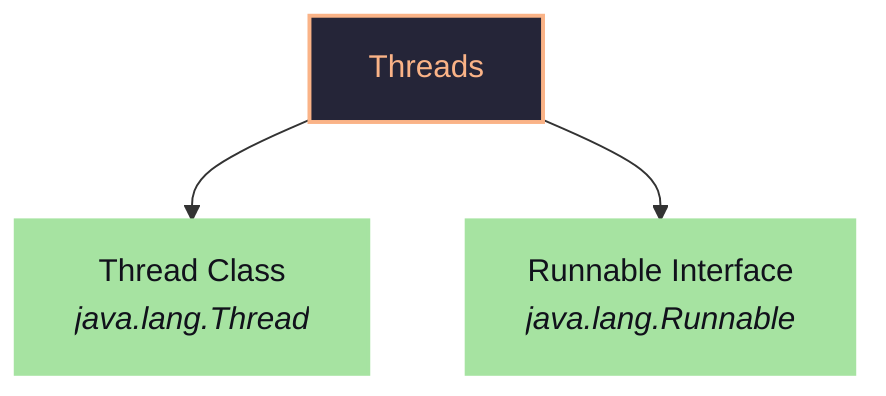
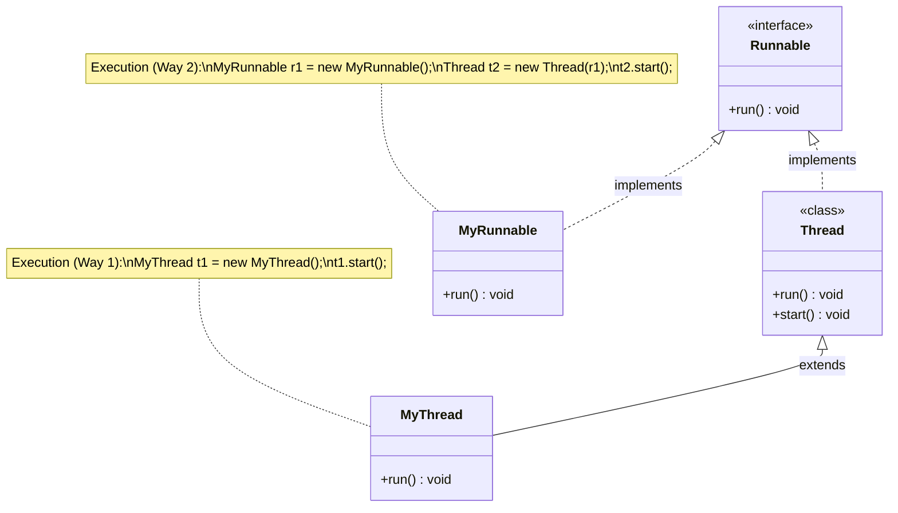
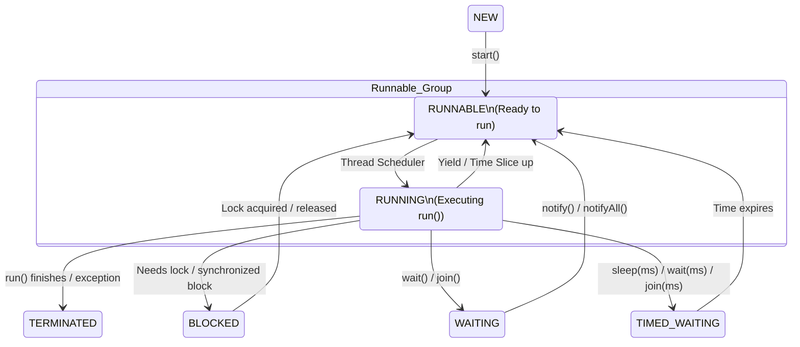
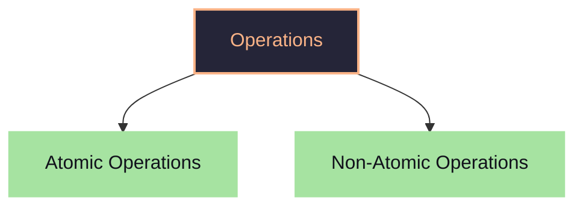
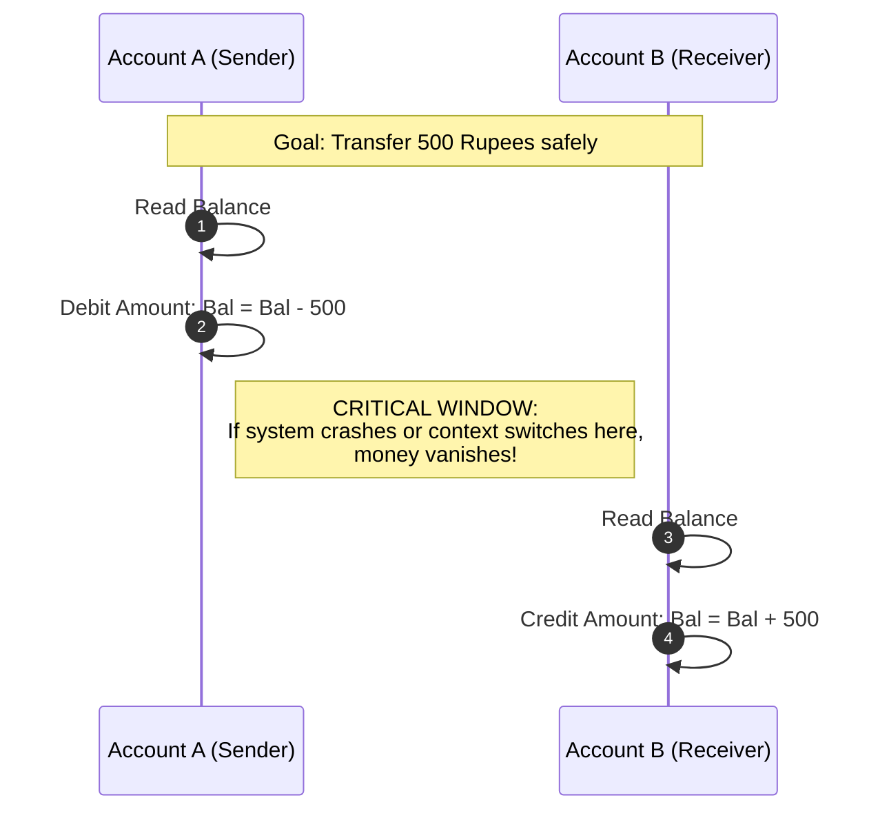

##### Why need multi-threading ?
- a thread is a flow of control(like by default has main thread)
- can have more threads to run this code
- fast execution because parallel processing but has many more advantages
- like IDE does auto-complete, error-check, LSP => doing many things at once.
###### Program : It is a set of instruction.(no happening things)
###### Process : A program in execution is a process.
program is a icon set of instruction
when run it, program goes from disk to RAM which became a process.
- A process is gets it's own heap, stack, method area, PC ...
- A process needs a RAM and CPU times => all process will share resource -> separated 
#### Threads
- Define : Smallest sequences of instruction executed by CPU independently. OR a lightweight process
a running program has to become process => process can be divided into parts -> threads
has 1st thread (main thread) by JVM
- can add more threads to a process
- if single core -> will do only one process at a time.
- CPU don't run process it run threads
> [!info]
> If a single core CPU then, it switches between task so fast it looks like parallel processing
- JVM start as process which will run the thread main
- JVM loads class ,bytes ,memory management ,GC
- manages memory JVM level managed by OS
- JVM use different ways to manage memory => for being platform independent 
- class loader will load main class -> which is to be run using main thread
Stack, PC <- new for each thread
heap, method area <- common among threads
#### Runs 
1. JVM loads into our process
2. JVM uses class loader
3. JVM creates a main thread
4. JVM creates separate stack and PC space
5. code execution start from main() methods
6. main stack frame -> loads main method
## Multi-threads
can make more threat makes => main, T1
have there, own stack and PC
CPU shares it's time between thread => this is called context switching for concurrent execution
- parallel execution : works simultaneous independently.(multi-core)
- concurrent execution : work by switching(single core)
many threads run
It example 2 core and 8 thread => use parallel and concurrent.

| Multi-tasking                   | multi-threading         |
| ------------------------------- | ----------------------- |
| OS concept.                     | CPU concept             |
| run many process simulataeously | runs many small process |
## Make thread
There are 2 ways to make class which will act as threads

Internally Thread implements `Runnable` interface
```java
public class demo {
    public static void main(String[] args) {
        MyThread t = new MyThread();
        t.start(); // Thread is running
    }
}
class MyThread extends Thread{
    @Override
    public void run(){
        // thread will run this code
        System.out.println("Thread is running");
    }
}
```
now, using interface
```java
public class demo {
    public static void main(String[] args) {
        Thread t = new Thread(new MyThread());
        t.start(); // Thread is running
    }
}
class MyThread implements Runnable{
    @Override
    public void run(){
        // thread will run this code
        System.out.println("Thread is running");
    }
}
```

| Thread class                                           | Runnable interface                   |
| ------------------------------------------------------ | ------------------------------------ |
| as it is `is-a` relation thus, makes a new thread only | as it is `can-do` , it task defining |
| Define a thread                                        | Define a task                        |

working 
- when do `.start()` => JVM asks OS to create a new thread
- thread will get it's own Stack and PC
- thread will run it's `run()` method
`Runnable` interface is preferable as it can behaves like normal class -> can extend it to other class(as if extend with thread can't do it). as can implement many interfaces
- separation of concern : only define task (not making a thread)
- re-usability => make many threads using it
- multiple inheritance (can extend other class)
`Runnable` is functional interface => can use lambda
```java
public class demo {
    public static void main(String[] args) {
        Thread t = new Thread(()-> System.out.println("Hello thread"));
        t.start(); // Hello thread
    }
}
```
#### what is name of thread?
- it has name and ID for debugging
```java
public class demo {
    public static void main(String[] args) {
        System.out.println(Thread.currentThread()); // Thread[#3,main,5,main]
        System.out.println(Thread.currentThread().getName()); // main
        System.out.println(Thread.currentThread().isAlive()); // true

        System.out.println(Thread.currentThread().getId()); // Depricated API 3

        System.out.println(Thread.currentThread().getPriority()); // 5
    }
}
```
why get id is deprecated ?
- as it gives false info
- as id is not numbering as thread execution order is un-determine-able
can do it for any thread
```java
public class demo {
    public static void main(String[] args) {
        Thread t1 = new Thread(()->{
            System.out.println("Name of my thread1 : "+Thread.currentThread().getName());;
            System.out.println("Id of my thread1 : "+Thread.currentThread().getId());;
        });
        Thread t2 = new Thread(()->{
            System.out.println("Name of my thread2 : "+Thread.currentThread().getName());;
            System.out.println("Id of my thread2 : "+Thread.currentThread().getId());;
        });
        Thread t3 = new Thread(()->{
            System.out.println("Name of my thread3 : "+Thread.currentThread().getName());;
            System.out.println("Id of my thread3 : "+Thread.currentThread().getId());;
        });

        t1.start();
        t2.start();
        t3.start();
        /*
Name of my thread1 : Thread-0
Name of my thread2 : Thread-1
Name of my thread3 : Thread-2
Id of my thread2 : 27
Id of my thread3 : 28
Id of my thread1 : 26 
         */
    }
}
```
see order of printing is not order of calling => as not waiting till it end -> all running together so order of execution is un-determinable.
### Start and run method
why not call run directly? why do `thread.start()` ?
- as it will run that function but not it concurrent
- run will run in order
```java
public class demo {
    public static void main(String[] args) {
        Thread t1 = new Thread(()->{
            System.out.println("Name of my thread1 : "+Thread.currentThread().getName());;
            System.out.println("Id of my thread1 : "+Thread.currentThread().getId());;
        });
        Thread t2 = new Thread(()->{
            System.out.println("Name of my thread2 : "+Thread.currentThread().getName());;
            System.out.println("Id of my thread2 : "+Thread.currentThread().getId());;
        });
        Thread t3 = new Thread(()->{
            System.out.println("Name of my thread3 : "+Thread.currentThread().getName());;
            System.out.println("Id of my thread3 : "+Thread.currentThread().getId());;
        });

        t1.run();
        t2.run();
        t3.run();
        /*
Name of my thread1 : main
Id of my thread1 : 3
Name of my thread2 : main
Id of my thread2 : 3
Name of my thread3 : main
Id of my thread3 : 3
        */
    }
}
```
here, it run in order -> not made new thread to run `run()` method concurrently and also name of thread is main.
#### Can we call same thread twice ?
-  no we can't call it more than once
```java
public class demo {
    public static void main(String[] args) {
        Thread t1 = new Thread(()->{
            System.out.println("Name of my thread1 : "+Thread.currentThread().getName());;
            System.out.println("Id of my thread1 : "+Thread.currentThread().getId());;
        });
        t1.start();
        t1.start(); // Exception in thread "main" java.lang.IllegalThreadStateException
    }
}
```
- thus, using `runnable` interface is better so we can make many thread of same object.
### Non-determinism
order of execution is un-predictable
```java
public class demo {
    public static void main(String[] args) {
        Thread evenprint = new Thread(()->{
            for(int i=0;i<10;i+=2){
                System.out.println("even: "+i);
            }
        });
        Thread oddprint = new Thread(()->{
            for(int i=1;i<10;i+=2){
                System.out.println("odd: "+i);
            }
        });
        evenprint.start();
        oddprint.start();
    }
    /*
even: 0
odd: 1
even: 2
even: 4
even: 6
even: 8
odd: 3
odd: 5
odd: 7
odd: 9 
     */
}
```
will do random order every-time when run it.
because
- CPU run thread and switches between threads and thus random order
- if more core -> still speed differ
- CPU -> has scheduling function algo to choose which thread to run
- parallelism might not give order because many software are running in background
- Scheduling algo 
	- Round Robin
	- Time slicing
	- Priority 
- it depends on
	- system load
	- hardware
	- time of creation of thread(when OS created thread)
If not handle threads carefully will face problem => error(which will occur sometime only)
### Life Cycle of thread
there are stages
- new : created thread but, not started yet(OS has not informed yet)
- runnable : OS is told to start running the thread(will go in queue of CPU will run it ASAP)
- running : thread has started running by CPU(internally run of thread is called by thread)
- terminated : ends execution of `run()` method by thread and thread is removed and can't be called again

other phases 
- critical section : part of code/resource which is used by multiple threads. this must be locked somewhere so can need only one can access it once
- this leads to race condition
- lock : is not to prevent access from threads, it is preventing simultaneous access of resource by multiple thread allows sequential access
- `Blocking state` : if some thread has accrued lock/IO tasks thus it can't use the locked state(thus can't run). which other thread will unlock the resource then, thread will be un-blocked and becomes running again.
- Also such thing on -> input (wait for user)
- runnable and running -> can be considered as one state => as CPU decides when to run thus, there is no difference for us as it is not in our control
- `Waiting` : if called `.wait()`,`.join()` is called on thread => used for inter-thread communications. will resume when called `.notify()`
- `Timed_waiting` : can make it wait for some time by `.sleep(time)`,`.join()`,`.wait(,time)` 
There are this 6 phases(consider runnable and running)
`.stop()` this is deprecated -> will go to terminated directly => not good practice

```java
import java.lang.Thread;

public class demo {
    public static void main(String[] args) {
        for (Thread.State state : Thread.State.values()) {
            System.out.println(state);
        } // NEW RUNNABLE BLOCKED WAITING TIMED_WAITING TERMINATED

        Thread t1 = new Thread(()->{
            System.out.println("Thread name "+Thread.currentThread().getName());
            System.out.println(Thread.currentThread().getState());
        });
        System.out.println(t1.getState()); 
        t1.start();
        System.out.println(t1.getState());
        try {
            Thread.sleep(2000);
        }catch(Exception e){}
        System.out.println(t1.getState());
        /*
NEW
RUNNABLE
Thread name Thread-0
RUNNABLE
TERMINATED
         */
    }
}
```
to see terminated state make main sleep for sometime
to see timed-waiting print in the state of main thread in running thread t1
```java
import java.lang.Thread;

public class demo {
    public static void main(String[] args) {
        Thread main = Thread.currentThread();

        Thread t1 = new Thread(()->{
            System.out.println("Thread name "+Thread.currentThread().getName());
            System.out.println("T1 state : "+Thread.currentThread().getState());
            System.out.println("Main thread state :"+main.getState());
        });
        System.out.println(t1.getState()); 
        t1.start();
        System.out.println(t1.getState());
        try {
            Thread.sleep(2000);
        }catch(Exception e){}
        System.out.println(t1.getState());
        /*
NEW
RUNNABLE
Thread name Thread-0
T1 state : RUNNABLE
Main thread state :TIMED_WAITING
TERMINATED
         */
    }
}
```
Blocked and waiting -> releases lock/IO if has accrued 
timed_waiting -> not releases locks/IO if has accrued
### Threads methods
- `.sleep()` -> give time in millisecond to send thread to TIMED_WAITING state. this will not release the locks.
```java
public class main {
    public static void main(String[] args) {
        Thread main = Thread.currentThread();
        System.out.println("main thread : "+main); // main thread : Thread[#3,main,5,main]
        try {
            main.sleep(2000); // 2 second
        } catch (InterruptedException e) {
            // TODO: handle exception
        }
        System.out.println("ends");
    }
}
```
- `t1.join()` -> tell to wait for it(t1) to end before executing the current thread.It makes it determine able.
```java
public class main {
    public static void main(String[] args) {
        System.out.println("Main Thread start");
        Thread t1 = new Thread(()->{
            try {
                Thread.sleep(2000);
            } catch (Exception e) {
                //TODO: handle exception
            }
            System.out.println("Child Thread start");
        });
        t1.start();
        try {
            t1.join(); // tell main thread to wait for child thread
        } catch (Exception e) {}
        System.out.println("Main Thread end");
        /*
Main Thread start
Child Thread start
Main Thread end 
         */
    }
}
```
Remember, tell t1 to join the main thread by waiting for it to terminate.
main will go to waiting till thread t1 reaches terminated state
if do `.join(millisecond)` to wait for this time if t1 went to terminated till then start main else after time start main anyways
```java
public class main {
    public static void main(String[] args) {
        System.out.println("Main Thread start");
        Thread t1 = new Thread(()->{
            try {
                Thread.sleep(2000);
            } catch (Exception e) {
                //TODO: handle exception
            }
            System.out.println("Child Thread start");
        });
        t1.start();
        try {
            t1.join(1000); // tell main thread to wait for child thread
        } catch (Exception e) {}
        System.out.println("Main Thread end");
/*
Main Thread start
Main Thread end
Child Thread start
*/
    }
}
```
- `.yield()` It is static method -> it will give it's CPU time to thread which has same priority as it. This is a request OS can reject this (thus not used much). It goes to `RUNABLE` not waiting
```java
public class main {
    public static void main(String[] args) {
        Thread t1 = new Thread(()->{
            for (int i = 1; i <= 10; i++) {
                System.out.println("t1 thread "+i);
                Thread.yield(); 
            }
        });
        Thread t2 = new Thread(()->{
            for (int i = 1; i <= 10; i++) {
                System.out.println("t2 thread "+i);
            }
        });
        t1.start();
        t2.start();
/*
output1:
t2 thread 1
t1 thread 1
t2 thread 2
t1 thread 2
t2 thread 3
t1 thread 3
t1 thread 4
t1 thread 5
t1 thread 6
t1 thread 7
t1 thread 8
t1 thread 9
t2 thread 4
t1 thread 10
t2 thread 5
t2 thread 6
t2 thread 7
t2 thread 8
t2 thread 9
t2 thread 10

output2:
t2 thread 1
t1 thread 1
t2 thread 2
t1 thread 2
t1 thread 3
t1 thread 4
t1 thread 5
t1 thread 6
t2 thread 3
t2 thread 4
t2 thread 5
t2 thread 6
t2 thread 7
t1 thread 7
t2 thread 8
t1 thread 8
t2 thread 9
t1 thread 9
t2 thread 10
t1 thread 10
 */
    }
}
```
- `.interrupt()` -> it send a signal to t1 to stop doing what it is doing.(OS can reject as it is request). it interrupt flag(default false) can't force it.
It is used as flag to handle gracefully handle thread
```java
public class main {
    public static void main(String[] args) throws InterruptedException {
        Thread t1=new Thread(()->{
            while(!Thread.currentThread().isInterrupted()){
                System.out.println("Running");
            }
        });
        t1.start();
        Thread.sleep(1000);
        t1.interrupt(); // gracefully handle the interrupt
    }
}
```
make a thread until a condition which is external 
cancelling a background long running task
used to stop thread pool
--> `.interrupt()` is a method to flag interrupted
--> `.interrupted()` return value value, also set it back to false
--> `.isInterrupted()` is boolean for interrupt flag value
if a thread is in TIMED_WAITING state can't call interrupt as will get `InterruptedException` ==> thus, need to check this exception when doing sleep, join, ...
- `.isAlive()` -> check if thread is working.It is alive from start -> terminated i.e when state is runnable or waiting
```java
public class main {
    public static void main(String[] args) throws InterruptedException {
        Thread t1=new Thread(()->{
            try {
                Thread.sleep(2000);
            } catch (Exception e) {}
        });
        System.out.println(t1.isAlive()); // false
        t1.start();
        System.out.println(t1.isAlive()); // true
        Thread.sleep(3000);
        System.out.println(t1.isAlive()); // false
    }
}
```
- `.currentThread()` -> provides reference of current running thread
```java
public class main {
    public static void main(String[] args) throws InterruptedException {
        Thread t1=new Thread(()->{
            System.out.println(Thread.currentThread().getName());
        });
        t1.start(); // Thread-0
    }
}
```
- `.setName(name)` -> name the thread
```java
public class main {
    public static void main(String[] args) throws InterruptedException {
        Thread t1=new Thread(()->{
            System.out.println(Thread.currentThread().getName());
        });
        t1.setName("worker-1");
        t1.start(); // worker-1
    }
}
```
- `.priority()` -> by default all thread have NORM and same priority of 5.
```java
/**
 * The minimum priority that a thread can have.
 */
public static final int MIN_PRIORITY = 1;

/**
 * The default priority that is assigned to a thread.
 */
public static final int NORM_PRIORITY = 5;

/**
 * The maximum priority that a thread can have.
 */
public static final int MAX_PRIORITY = 10;
```
can get and set priority
```java
public class main {
    public static void main(String[] args) throws InterruptedException {
        Thread t1=new Thread(()->{
            System.out.println("Custome thread");
        });
        System.out.println(t1.getPriority()); // 5
        t1.setPriority(7);
        System.out.println(t1.getPriority()); // 7
        t1.start(); // Custome thread
    }
}
```
java tells OS what is priority of thread. higher priority thread runs first.It will be indication at end OS decides.
Depends on OS it may respect or not respect.(thus not used)
### Daemon thread
background running thread are called daemon.
like there is notification daemon
Thread are of 2 types -> User,Daemon thread
> [!info]
> Program will not end until all user thread have terminated

```java
public class main {
    public static void main(String[] args) throws InterruptedException {
        Thread t1=new Thread(()->{
            while (true) {
                System.out.println("running");
            }
        });
        t1.start();
        return; // main end
    }
}
```
this will print running(infinity) even after main thread end as t1 is still running
if t1 is daemon then, will end it as soon as all user thread end
```java
public class main {
    public static void main(String[] args) throws InterruptedException {
        Thread t1=new Thread(()->{
            while (true) {
                System.out.println("running");
            }
        });
        t1.setDaemon(true);
        t1.start();
        Thread.sleep(100);
        return; // main end
    }
}
```
this will stop running as after 100 ms
examples of daemon thread
- Garbage collection -> runs on daemon thread
- notification checking
## Multi-threaded problems
problems
#### Race conditions => final state of program depends on order of execution of threads(thus undetermined)
```java
int count=0;
count++; // risky statement
```
as it not atomic statement as have 3 steps
- read count from memory
- increment count by 1
- write updated value 
in multiple thread => may lead to race condition

| **Steps** | **Thread 1 (T1)** | **Thread 2 (T2)** | **Value of C (Shared Heap)** | **Notes / Conflict**                      |
| --------- | ----------------- | ----------------- | ---------------------------- | ----------------------------------------- |
| **①**     | `Read C = 0`      | _Idle_            | `0`                          | T1 caches local copy `C = 0`              |
| **②**     | _Idle_            | `Read C = 0`      | `0`                          | T2 caches local copy `C = 0`              |
| **③**     | `C = C + 1`       | _Idle_            | `0`                          | T1 increments local frame variable to `1` |
| **④**     | _Idle_            | `C = C + 1`       | `0`                          | T2 increments local frame variable to `1` |
| **⑤**     | `Write(1)`        | _Idle_            | **`1`**                      | T1 flushes `1` back to main memory        |
| **⑥**     | _Idle_            | `Write(1)`        | **`1`**                      | T2 overwrites main memory with `1`        |

It can introduce race condition => undetermined behavior
```java
public class main {
    public static void main(String[] args) throws InterruptedException {
        Counter c = new Counter();
        Thread t1 = new Thread(()->{
            for(int i=0;i<1000;i++){
                c.increment();
            }
        });
        Thread t2 = new Thread(()->{
            for(int i=0;i<1000;i++){
                c.increment();
            }
        });
        t1.start();
        t2.start();
        // wait for both threads
        t1.join();
        t2.join();
        // 1000 + 1000 = 2000 (logical)
        System.out.println(c.count);  // 1817 | 1872 | 1553 | 1737
    }
}
class Counter{
    public int count=0;
    public void increment(){
        count++;
    }
}
```
some increments are lost every-time
critical section is a part which is access by multiple thread which is to be protected by lock so only one thread can enter.
count is a shared resource => lies inside critical section
#### Atomicity problem
as operation are in steps not atomic
- read count from memory
- increment count by 1
- write updated value 
in java operation are of 2 types

atomic operation can't have race condition => will either fail or success => any operation that either happens completely or not at all.
but non-atomic operation => sequence of atomic operations
example:

try to make operation atomic.
solving atomicity problem will solve race condition also.
- assignment is atomic operation => x=2 --> this is simple write
- `Student s1=new Student()` -> atomic operation
generally, logic is not atomic
some time
```java
double d=112.234;
```
treads as 2 operation 32-bit and 32-bit write. as full 64 bit is not write at once.
### Visibility problem
one thread updates a variable, but another thread does not see the updated value
CPU put data in register then cache then in ram

```mermaid
graph TD
    subgraph RAM_Space [Main Memory]
        SharedRAM["Shared RAM<br/>(Global variables live here)"]
    end

    subgraph Core2 [CPU Core 2]
        CPU2["CPU Core 2"]
        Cache2["L1/L2 Cache 2<br/>(Local Copy)"]
        CPU2 <--> Cache2
    end

    subgraph Core1 [CPU Core 1]
        CPU1["CPU Core 1"]
        Cache1["L1/L2 Cache 1<br/>(Local Copy)"]
        CPU1 <--> Cache1
    end

    %% Hardware Interconnects
    Cache1 <--> SharedRAM
    Cache2 <--> SharedRAM

    %% Styling Elements
    classDef default fill:#1e1e2e,stroke:#cdd6f4,stroke-width:2px,color:#cdd6f4;
    classDef cpuStyle fill:#fab387,stroke:#fab387,stroke-width:2px,color:#11111b;
    classDef cacheStyle fill:#a6e3a1,stroke:#a6e3a1,stroke-width:2px,color:#11111b;
    classDef ramStyle fill:#2a2b3d,stroke:#fab387,stroke-width:2px,color:#fab387;

    class CPU1,CPU2 cpuStyle;
    class Cache1,Cache2 cacheStyle;
    style RAM_Space fill:#11111b,stroke:#cdd6f4;
```

this is due to multiple source of truth.
```java
public class main {
    static boolean flag = false; 
    public static void main(String[] args) throws InterruptedException {
        Thread t1 = new Thread(()->{
            try {
                Thread.sleep(1000);
            } catch (Exception e) {}
            flag=true;
        });
        Thread t2 = new Thread(()->{
            while(!flag){
                // System.out.println("Thread 2 is running"); // it is by default in a synchronized block => read by 
            }
            System.out.println("Thread 2 finished");
        });
        t1.start();
        t2.start();
        // this code runs infinity => because flage if cached in thread 2's cache
        // flag = true; is done in t1's cache then RAM
        // but, still flag of t2 is readed by it's cache
    }
}
```
this make infinite program
this problem solved by keyword volatile
```java
public class main {
    static volatile boolean flag = false; 
    public static void main(String[] args) throws InterruptedException {
        Thread t1 = new Thread(()->{
            try {
                Thread.sleep(1000);
            } catch (Exception e) {}
            flag=true;
        });
        Thread t2 = new Thread(()->{
            while(!flag){
                // System.out.println("Thread 2 is running"); // it is by default in a synchronized block => read by 
            }
            System.out.println("Thread 2 finished");
        });
        t1.start();
        t2.start();
        // volatile make it un-cache able => everyone will read from RAM only
    }
}
```
volatile make it un-cache able => everyone will read from RAM only --> read and write happens in RAM only.
it will stop this problem(making single source of truth)
it won't fix race condition
if `synchronized` used (like `println` uses it internally) it will flush out cache and give code to only one thread at a time. -> locking mechanism> 
> [!note]
> Thus print on terminal is atomic as it is made synchronized by java internal implementation

### Ordering 
the sequence in which instruction are executed(top to bottom and left to right).
- JVM may optimize it so may not follow this order.
- JVM reorder making sure will not make any problem in single threaded env
```java
public class main {
    static boolean flag = false; 
    static int x=0;
    public static void main(String[] args) throws InterruptedException {
        Thread t1 = new Thread(()->{
            x=10;
            flag=true;
        });
        Thread t2 = new Thread(()->{
            if(flag==true){
                System.out.println(x);
            }
        });
        t1.start();
        t2.start(); // 0 

    }
}
```
as we tried to make it order so output is 10 but JVM may reorder and make `flag=true` and switch to thread `t2` leaving `x=0` thus, unexpected 0 comes sometime
many possibility
- `0` if reordered and switch (VERY RARE)
- `10` if no reorder happen and `t1` run first the `t2` runs (MOST LIKELY)
- ` ` if `t2` excited 1st then `t1` thus no output (1 in 10 tries)
can be solved by synchronized and volatile
### Thread interference
thread will interference due to 
- non atomic operations
- shared resource
- race conditions
- ordering
- visibility
This leads to data(MOST IMP) inconsistency
solutions
- synchronized block (fix everything till race condition make tings atomic -> like single threads)
- volatile(fix ordering and visibility)
