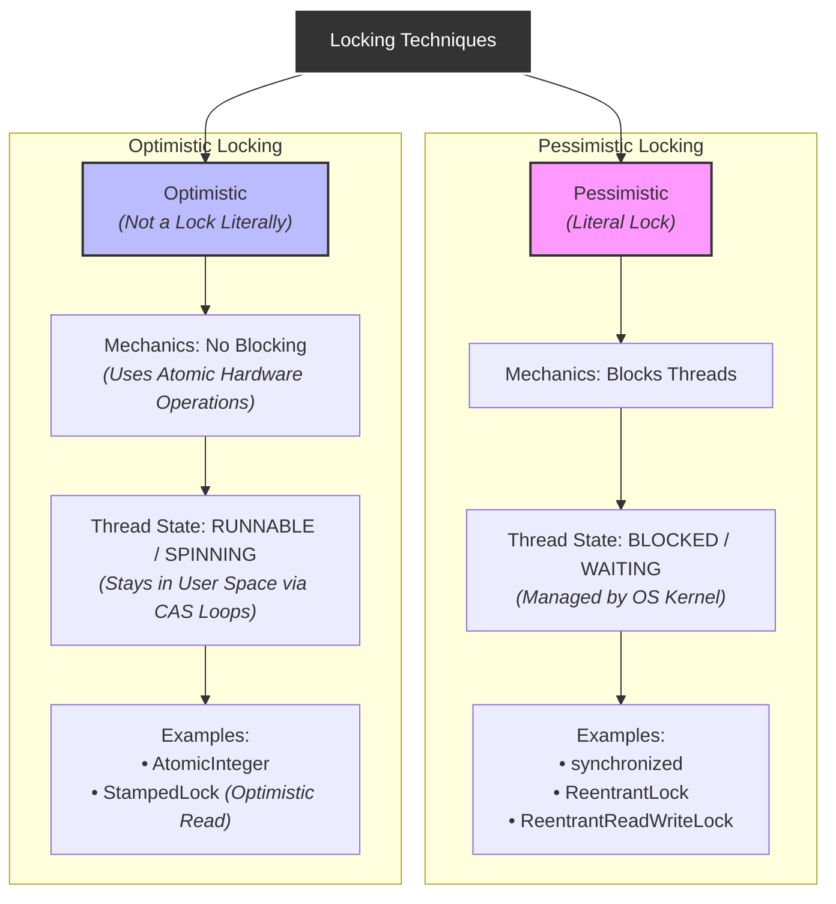
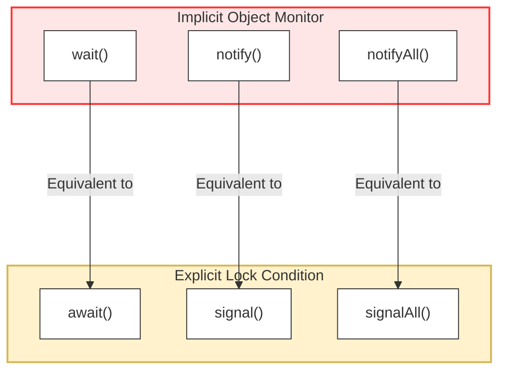

## Synchronized
we need to protect critical section by locking it.
protect shared resource => as non-atomic operation
```java
public class demo {
    public static void main(String[] args) throws InterruptedException {
        Counter c=new Counter();
        Thread t1=new Thread(()->{
            for (int j = 0; j < 1000; j++) {
                c.increment();
            }
        });
        Thread t2=new Thread(()->{
            for (int j = 0; j < 1000; j++) {
                c.increment();
            }
        });
        t1.start();
        t2.start();
        t1.join();
        t2.join();
        // if no race condition is there 1000+1000 = 2000 count
        System.out.println(c.count); // 2000 always
    }
}
class Counter{
    public int count;
    synchronized void increment(){
        count++;
    }
}
```
synchronized make the increment method atomic.
only one thread can enter the method at once.
if t1 and t2 are running threads then,
- t1 acquire lock
- t2 tries to enter increment but gets blocked
- t1 performs any amount of time to complete task
- t1 release lock
- t2 acquires lock and so on...
```java
public class demo {
    public static void main(String[] args) throws InterruptedException {
        Test t=new Test();
        Thread t1=new Thread(()->{
            t.show();
        });
        Thread t2=new Thread(()->{
            t.show();
        });
        t1.start();
        t2.start();
        t1.join();
        t2.join();
        /*
Thread-1:Inside show
Thread-0:Inside show
Thread-0:After sleep
Thread-1:After sleep
         */
    }
}
class Test{
    void show(){
        System.err.println(Thread.currentThread().getName()+":Inside show");
        try {
            Thread.sleep(1000);
        } catch (InterruptedException e) {
            e.printStackTrace();
        }
        System.err.println(Thread.currentThread().getName()+":After sleep");
    }
}

```
both thread entire together and call show and takes 1 second
```java
public class demo {
    public static void main(String[] args) throws InterruptedException {
        Test t=new Test();
        Thread t1=new Thread(()->{
            t.show();
        });
        Thread t2=new Thread(()->{
            t.show();
        });
        t1.start();
        t2.start();
        t1.join();
        t2.join();
        /*
Thread-0:Inside show
Thread-0:After sleep
Thread-1:Inside show
Thread-1:After sleep
        */
    }
}
class Test{
    synchronized void show(){
        System.err.println(Thread.currentThread().getName()+":Inside show");
        try {
            Thread.sleep(1000);
        } catch (InterruptedException e) {
            e.printStackTrace();
        }
        System.err.println(Thread.currentThread().getName()+":After sleep");
    }
}
```
why do we need synchronized ??
- to protect shared data
- to make any operation atomic
- to ensure visibility => as make sure read from RAM and flush cache
- to prevent re-ordering(can also use volatile)
only the block which is synchronized will be locked not the full code
```java
{
...
	synchronized {
		...
	}
...
}
```
### Monitor locks
this is concept behind synchronized. also called as object lock
what is lock
- it is a permission token 
- which is give to one thread at a time
synchronized is applied to a class or object not on method
```java
class count{
	synchronized void inc(){
		count++;
	}
	synchronized void inc1(){
		count++;
	}
	synchronized void inc2(){
		count++;
	}
}
```
- all object in java has internal lock
- which can be acquired by a thread
- this lock is maintained by JVM
- lock belongs to class and object only
`inc`,`inc1`,`inc2` all are locked as class lock is aquired
```java
public class demo {
    public static void main(String[] args) throws InterruptedException {
        Test t=new Test();
        Thread t1=new Thread(()->{
            t.m1();
            t.m2();
        });
        Thread t2=new Thread(()->{
            t.m1();
            t.m2();
        });
        t1.start();
        t2.start();
        t1.join();
        t2.join();
        /*
Thread-0: m1 enter    1 second later
Thread-0: m1 exit
Thread-0: m2 enter    1 second later
Thread-0: m2 exit
Thread-1: m1 enter    1 second later
Thread-1: m1 exit      
Thread-1: m2 enter    1 second later 
Thread-1: m2 exit
         */
    }
}
class Test{
    synchronized void m1(){
        System.err.println(Thread.currentThread().getName()+": m1 enter");
        try {
            Thread.sleep(1000);
        } catch (Exception e) {
            //TODO: handle exception
        }
        System.err.println(Thread.currentThread().getName()+": m1 exit");
    }
    synchronized void m2(){
        System.err.println(Thread.currentThread().getName()+": m2 enter");
        try {
            Thread.sleep(1000);
        } catch (Exception e) {
            //TODO: handle exception
        }
        System.err.println(Thread.currentThread().getName()+": m2 exit");
    }
}
```
lock is same thus take 4 second for 4 calls
> [!note]
> as 1 object has 1 lock

### synchronized block
if small part of method synchronized
```java
static{

}
synchronized(){

}
```
will work same 
```java
class Counter{
    public int count;
    void increment(){
        synchronized (this){
            count++;
        }
    }
}
```
as to avoid overhead of synchronized
## custom lock
```java
public class demo {
    public static void main(String[] args) throws InterruptedException {
        Bank b1 = new Bank();
        Thread t1 = new Thread(()->b1.deposit());
        Thread t2 = new Thread(()->b1.widthdraw());
        t1.start();
        t2.start();
        /*
Widthdraw
Deposit            after 1 second
         */
    }
}
class Bank{
    Object lock1 = new Object();
    Object lock2 = new Object();
    void deposit(){
        synchronized(lock1){
            try {
                Thread.sleep(1000);
            } catch (Exception e) {}
            System.out.println("Deposit");
        }
    }
    void widthdraw(){
        synchronized(lock2){
            try {
                Thread.sleep(1000);
            } catch (Exception e) {}
            System.out.println("Widthdraw");
        }
    }
}
```
as can call different methods from same object 
as can entire 2 method by different method
can execute multiple threads in a class
```java
    void m1(){
        synchronized(new Object()){
            System.err.println(Thread.currentThread().getName()+" Entered m1");
            try {
                Thread.sleep(1000);
            } catch (Exception e) {}
            System.err.println(Thread.currentThread().getName()+" exited m1");
        }
    }
```
this is same as no lock => always new lock => will never release lock.
## Static synchronized
if put static(class thing) and synchronized on a method
```java
public class demo {
    public static void main(String[] args) throws InterruptedException {
        Thread t1=new Thread(()->{
            Count.increment();
        });
        Thread t2=new Thread(()->{
            Count.increment();
        });
        t1.start();
        t2.start();
        t1.join();
        t2.join();
        /*
1       1 second later
2       1 second later
         */
    }
}
class Count{
    static int count=0;
    synchronized static void increment(){
        try {
            Thread.sleep(1000);
        } catch (Exception e) {}
        count++;
        System.out.println(count);
    }
}
```
when make lock over static method we are taking a lock over class not method
it is same as
```java
class Count{
    static int count=0;
    static void increment(){
        synchronized(Count.class){
            try {
                Thread.sleep(1000);
            } catch (Exception e) {}
            count++;
            System.out.println(count);
        }
    }
}
```
if uses class and object for are different and unique 
so if static method gives a class lock then another method of object can entire it.
each class and each object gives unique lock.
### Lock internal working
each object and class has it's own unique lock which can be acquired by thread.
lock is also a object
```java
lock{
	owerThread:null;
	isLocked:false;
	waitingQueue:[];
}
```
if due to synchronized word
```java
if(obj.lock.isLocked==false){
	Obj.lock.isLocked=true;
	obj.lock.ownerThread=1;
}else{
	// someone is already inside
	obj.lock.waitingQueue.push(t2);
}
```
this will be also check-then-act will lead to race condition
solution :- This operation of transferred by `CAS`.
synchronized is a overhead and make it slow.
## Inter-thread communications
thread might interfere with each other by using shared resource => can be handled by lock(synchronized).
all this is method are of Object class
- `.wait()` -> 
- `.notify()` 
- `.notifyAll()` 
##### Producer consumer problem
Producer makes value and consumer uses it.

as multi-threading is undetermined-able we can't have clean produce then consume => may lead to consume or other possibility
- consumer try to consume null value
- producer produces more value and consumer can't consume it at that speed(data loss)
Thus, there is a need to make communication between threads
```java
public class main {
    public static void main(String[] args) {
        Box b=new Box();
        Thread producer=new Thread(()->{
            b.produce(1);
        });
        Thread consumer=new Thread(()->{
            b.consume();
        });
        producer.start();
        consumer.start();
        /*
1st possiblity
consumed 1
produced 1

2nd possiblity
consumed null
produced 1
         */
    }
}
class Box{
    Integer item;
    Boolean flag=false;
    void produce(int value){
        item=value;
        flag=true;
        System.out.println("produced "+value);
    }
    Integer consume(){
        Integer a=item;
        flag=true;
        item=null;
        System.out.println("consumed "+a);
        return a;
    }
}
```
consume 100 value and produces
```java
public class main {
    public static void main(String[] args) {
        Box b=new Box();
        Thread producer=new Thread(()->{
            for(int i=1;i<=10;i++) b.produce(i);
        });
        Thread consumer=new Thread(()->{
            for(int i=1;i<=10;i++) b.consume();
        });
        producer.start();
        consumer.start();
        /*
consumed 1
consumed null
consumed null
consumed null
consumed null
produced 1
consumed null
produced 2
produced 3
produced 4
produced 5
consumed 2
produced 6
produced 7
produced 8
produced 9
consumed 6
produced 10
consumed 10
consumed null
         */
    }
}
```
synchronized can't solve this problem
- as it only make sure no race condition
- but still producer and consumer thread will run undetermined order
- will not be able to make sure producer run first then, consumer
Solution :- write condition to check to produce if and only if consumer and then, consumer if only if has non null value. ==> using while loop.
```java
public class main {
    public static void main(String[] args) {
        Box b=new Box();
        Thread producer=new Thread(()->{
            b.produce(1);
        });
        Thread consumer=new Thread(()->{
            b.consume();
        });
        producer.start();
        consumer.start();
        /*
           Only possiblity
consumed 1
produced 1
         */
    }
}
class Box{
    volatile Integer item;
    Boolean flag=false;
    synchronized void produce(int value){
        while(item!=null){}
        item=value;
        flag=true;
        System.out.println("produced "+value);
    }
    synchronized Integer consume(){
        while(item==null){}
        Integer a=item;
        flag=true;
        item=null;
        System.out.println("consumed "+a);
        return a;
    }
}
```
problem while -> is wasting(busy waiting) CPU time.
also need to make volatile(to make sure check is used from RAM not cache) and synchronized(to avoid race condition for 1st produce consume -> made atomic).
but problem with locking => while loop might be infinite 
so many problems(dead lock)
##### Waiting state
can we make wait if can't produce
Problems in thread communications
- shared resource
- condition
- waiting
here, problem is shared resource(item), condition(item == null) and wait on bases this conditions
- `.wait()` -> will pause thread and release all locks and goes to WAITING state until another thread wakes it up by notify(better version of while busy wait)
if apply it to non-synchronized it will give `IllegalMonitorStateException` 
- `.notify()` -> bring thread back from WAITING
- `.notifyAll()` -> bring all thread back from WAITING
as each lock has `waitingQueue[]` puts thread in on wait()
`wait()` -> puts thread in the queue
`.notify()` -> pop for queue and puts in blocked state(try to acquire lock and run) but, it walks up random thread
- one random thread is picked from waiting queue
- that thread goes -> BLOCKED state
- compete for lock
- once lock occupied --> RUNNING state
- It should also be in synchronized block
```java
public class main {
    public static void main(String[] args) {
        Box b=new Box();
        Thread producer=new Thread(()->{
            for (int i = 0; i < 10; i++) b.produce(i);
        });
        Thread consumer=new Thread(()->{
            for (int i = 0; i < 10; i++) b.consume();
        });
        producer.start();
        consumer.start();
        /*
           always 
produced 0
consumed 0
produced 1
consumed 1
produced 2
consumed 2
produced 3
consumed 3
produced 4
consumed 4
produced 5
consumed 5
produced 6
consumed 6
produced 7
consumed 7
produced 8
consumed 8
produced 9
consumed 9
         */
    }
}
class Box{
    volatile Integer item;
    Boolean flag=false;
    synchronized void produce(int value){
        while(item!=null){
            try {
                wait();
            } catch (Exception e) {}
        }
        item=value;
        flag=true;
        System.out.println("produced "+value);
        try {
            notify();
        } catch (Exception e) {}
    }
    synchronized Integer consume() {
        while(item==null){
            try {
                wait();
            } catch (Exception e) {}
        }
        Integer a=item;
        flag=true;
        item=null;
        System.out.println("consumed "+a);
        try {
            notify();
        } catch (Exception e) {}
        return a;
    }
}
```
established communicates between producer and consumer.
-> thread safe and no dead lock
- `.notifyall()`
	- all threads in waiting queue are moved to BLOCKED state
	- they all try to acquire lock 
	- only one gets the lock at a time
it is safer than `.notify()` because makes sure all are released(if multiple consumer and producers)
if producer/consumer are only released by notify at random.
thus, will lead to dead lock
thus, notify all is better.
```java
class Box{
    volatile Integer item;
    Boolean flag=false;
    synchronized void produce(int value){
        while(item!=null){
            try {
                wait();
            } catch (Exception e) {}
        }
        item=value;
        flag=true;
        System.out.println("produced "+value);
        try {
            notifyAll();
        } catch (Exception e) {}
    }
    synchronized Integer consume() {
        while(item==null){
            try {
                wait();
            } catch (Exception e) {}
        }
        Integer a=item;
        flag=true;
        item=null;
        System.out.println("consumed "+a);
        try {
            notifyAll();
        } catch (Exception e) {}
        return a;
    }
}
```
if using notify -> make sure have one thread of one type only 1 producer and 1 consumer
all this methods belong to Object.
because thread acquire lock from object => as it has lock and queue
sleep => timed wait
wait => wait till notify
> [!error]
> thread might get out of waiting by it's own decided by JVM
> 100% not guratte it will not come out of waiting are automatically
> It is called Spurious wakeUp as OS and CPU decides JVM don't have full control

Spurious wake-up avoided by while loop => as made up of condition while(to avoid irregular wake up).
thus don't use if condition => may lead to irregular wake up.
This while is called Guarded block
IRL example of producer and consumer

## Java lock
by default there is a lock for each object and class which is handled by synchronized keywords
There is `Lock` interface. --> need two method `lock()` and `unlock()`
Limitation of synchronized block
- No control over lock
	- thread goes to waiting if can't acquire lock => can't make thread do something else if can't acquire lock
- No timeout
	- wait can last forever/ no limit on how long a thread can have lock.
- No fairness
	- random order of entry in lock and no system on how to give lock(1st arrival may not get lock first) leads to starvation(waiting but not get lock for long time).
when not get lock will get in BLOCKING state
and if called `.wait()` will go in WAITING state
Lock interface uses more flexibility
###### Type of Lock
- `Reentrant` lock
- `readwrite` lock
- `stamped` lock
- `semaphore`
#### Reentrant lock
```java
Lock lock=new ReentrantLock();

lock.lock();
// critial section
...
lock.unlock();
// normal
```
there are problem with this manual lock and unlock
- forget to unlock will lead to make single thread only.
- if exception then will come out without unlocking even if wrote unlock
so we should to 
```java
try{
}catch{
}finally{
	lock.unlock();
}
```
as finally will excute anyway.
```java
import java.util.concurrent.locks.ReentrantLock;
import java.util.concurrent.locks.*;

public class main {
    public static void main(String[] args) {
        Resource r1=new Resource();
        Thread t1=new Thread(()->{
            r1.f1();
        });
        Thread t2=new Thread(()->{
            r1.f1();
        });
        Thread t3=new Thread(()->{
            r1.f1();
        });
        t1.start();
        t2.start();
        t3.start();
        /*
Thread-0 Entered
Thread-0 Exited          1 second later
Thread-1 Entered
Thread-1 Exited          1 second later
Thread-2 Entered
Thread-2 Exited          1 second later
         */
    }
}
class Resource{
    Lock lock=new ReentrantLock();
    void f1(){
        lock.lock();
        try {
            System.out.println(Thread.currentThread().getName()+" Entered");
            try {
                Thread.sleep(1000);
            } catch (Exception e) { }
            System.out.println(Thread.currentThread().getName()+" Exited");
        } finally {
            lock.unlock();
        }
    }
}
```
This is a lock of object => here make a new object named lock => now not locking Resource object, locking the object of Reentrant lock => which gives many function.
```java
if(lock.trylock()){
	try{
		// critical resource
	}finally{
		lock.unlock();
	}
}else{
	// do if not get lock
}
```
try to get lock
It is called Reentrant because :- same thread can acquire lock multiple times by 
```java
lock.lock();
lock.lock();
lock.lock();
lock.lock();


// now need to unlock 3 times also
```
if call a method inside the critical section so it can be locked again
```java
import java.util.concurrent.locks.Lock;
import java.util.concurrent.locks.ReentrantLock;

public class ReentrantDemo {
    // The shared lock object instance
    private final Lock lock = new ReentrantLock();

    public void methodA() {
        lock.lock(); // First acquisition: Hold count becomes 1
        try {
            System.out.println("Inside methodA - calling methodB");
            methodB(); 
        } finally {
            lock.unlock(); // Decrements hold count to 0: Lock fully released
        }
    }

    public void methodB() {
        lock.lock(); // Re-entrant acquisition: Hold count becomes 2!
        try {
            System.out.println("Inside methodB - safely executed");
        } finally {
            lock.unlock(); // Decrements hold count back to 1
        }
    }
}
```
in other lock if did this lead to dead lock 
synchronized is also a Reentrant lock.
##### Methods on Reentrant lock
- `.lock()` -> to acquire lock
- `.unlock()` -> to free lock, if no lock will give `IllegalMonitorState` exception
- `.trylock()` -> in else make thread do something else
- `.trylock(timeOut,TimeUnit)` -> example `trylock(2,TimeUnit.SECOND)` this make thread wait for 2 second to acquire lock if not get after 2 second will go to the else block.
- `.isLocked()` -> true/false use for monitor and debug which is not atomic
- `.isHeldByCurrentThread()` -> true/false 
- `.getHoldCount()` -> as can lock many time Reentrant lock thus, give count how many times is locked
- `.isFair()` -> check if lead to starvation or not => who comes first will get lock, lock is given based on waiting time of thread.
```java
Reentrant l1=new Reentrant(); // make unfair
Reentrant l2=new Reentrant(true); // make approx fair
```
#### Read write lock
need to allow many thread to use resource => if they are read-only.
reading is non-destructive, writing is destructive.
Exclusive lock -> for writing thread
Shared lock -> reading thread
This will give `readlock()` and `writelock()` -> of type Lock
allows multiple reads but only 1 reader
- many reader -> all allowed
- one writer -> allowed 
- many writer -> not allowed together
- 1 writer 1 reader -> not allowed together
used in reader and writer problem => example google docs many reader and writer(will make problem by overriding each other).

```java
import java.util.concurrent.locks.ReentrantLock;
import java.util.concurrent.locks.*;

public class main {
    public static void main(String[] args) {
        Resource res=new Resource();
        Thread t1=new Thread(()-> res.read());
        Thread t2=new Thread(()-> res.write(10));
        Thread t3=new Thread(()-> res.read());
        Thread t4=new Thread(()-> res.write(20));
        Thread t5=new Thread(()-> res.read());
        Thread t6=new Thread(()-> res.write(30));
        Thread t7=new Thread(()-> res.read());
        Thread t8=new Thread(()-> res.write(40));
        t1.start();
        t2.start();
        t3.start();
        t4.start();
        t5.start();
        t6.start();
        t7.start();
        t8.start();
    }
}
class Resource{
    private int value=0;
    ReadWriteLock rwlock=new ReentrantReadWriteLock();
    Lock rl=rwlock.readLock();
    Lock wl=rwlock.writeLock();

    public void read(){
        rl.lock();
        try {
            try {
                Thread.sleep(1000);
            } catch (Exception e) { }
            System.out.println(Thread.currentThread().getName()+" reads "+value);
        } finally {
            rl.unlock();
        }
    }
    public void write(int newValue){
        wl.lock();
        try {
            try {
                Thread.sleep(1000);
            } catch (Exception e) { }
            value=newValue;
            System.out.println(Thread.currentThread().getName()+" writes "+value + " to "+newValue);
        } finally {
            wl.unlock();
        }
    }
}
```
all read threads run together put write is one by one only.
```bash
Thread-1 writes 10 to 10
Thread-0 reads 10 
Thread-4 reads 10 
Thread-5 writes 30 to 30 
Thread-3 writes 20 to 20 
Thread-2 reads 20 
Thread-6 reads 20 
Thread-7 writes 40 to 40
```
why read lock just make it no lock
- This is to avoid any writer thread to enter
This can also be make fair, but may lead to starvation
- writer may starvation due to excess reader who will not allow writer(only 1 reader entry it will only get reader in which will increase waiting time for writer)
- It is called by writer starvation
#### Lock downgrading
write lock -> read lock 
opposite is not possible.
```java
writelock.lock();
try{
	readlock.lock();
}finally{
	writelock.unlock();
	try{
	
	}finally{
		readlock.unlock();
	}
}
```
downgrading occupy lower lock first then unlock => to avoid any other writer entry.
### Stamped Lock
It is modern version of read-write lock
- `writeLock()`
- `readLock()`
- `tryOptomisticRead()` 
It works on stamps like an ID(long)
it not gives lock it gives token like stamp.

 Optimistic lock is only for reading.
 ###### try optimistic read
 - get a stamp
 - read data WITHOUT locking
 - check if data is modified 
	 - yes, fall-over and use real look
	 - continue
it check modification by stamp it is like SHA-256 hash for that state of code.
```java
class Resource{
    private int value=0;
    StampedLock lock=new StampedLock();

    public void read(){
        long stamp=lock.tryOptimisticRead();
        int currentValue=value;
        try {
            Thread.sleep(1000);
        } catch (Exception e) {}
        if(lock.validate(stamp)==false){
            // fall over
            stamp=lock.readLock();
            try {
                currentValue=value;
            } finally {
                lock.unlockRead(stamp);
            }
        }
        System.out.println(Thread.currentThread().getName()+" reads "+value);
        
    }
    public void write(int newValue){
        long stamp=lock.writeLock();
        try {
            try {
                Thread.sleep(1000);
            } catch (Exception e) { }
            value=newValue;
            System.out.println(Thread.currentThread().getName()+" writes "+value + " to "+newValue);
        } finally {
            lock.unlockWrite(stamp);
        }
    }
}
```
all writer run one by one and then all reader run together
```bash
Thread-1 writes 10 to 10
Thread-3 writes 20 to 20
Thread-5 writes 30 to 30 
Thread-0 reads 30 
Thread-2 reads 30 
Thread-4 reads 30
```
stamped lock is not Reentrant
#### Semaphore
it is not lock, but like a lock.
now need to allow multiple(n defined count) threads to entire.
it has permit count(no of threads allowed)
- `.aquire()` -> takes one permit if available, else sent to WAITING state
- `.release()` -> make one permit
there are 2 types
- Binary semaphore :- like lock either enter or not `Semaphore s1=new Semaphore(1);`
- Counting :- more than one permits
Difference between lock and semaphore

| Locks                                                            | Semaphores                                            |
| ---------------------------------------------------------------- | ----------------------------------------------------- |
| Ownership based a thread is owner                                | no ownership, any thread can take and release permits |
| owner can only release                                           | any thread can release                                |
| ordering and ownership(can have multiple owners in shared locks) | nothing only count based                              |
can be made fair and non-fair
Why use semaphore
- API rate limiter
- parallel task limited
### Condition interface
different from Object interface
condition is a waiting area(different from waiting queue)
each condition is tied to a lock
```java
Lock l1=new Reentrant();
Condition c1=l1.newCondition();
```
now can call method on c1

can make multiple waiting queues by using many Condition object
If like many producer and many consumer => make 2 condition for consumer and producer => separated queue now can decide what to notify(signal) a consumer or a producer.
it solve problem(Dead lock) with notify(where solve by notify all) now can use this.
Still problem of spurious wake up => so use while loop