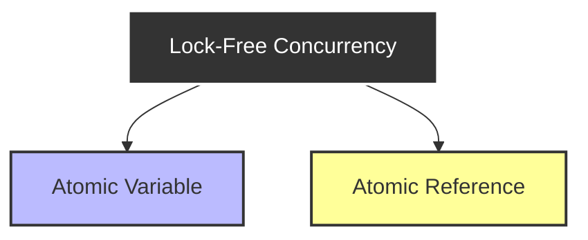
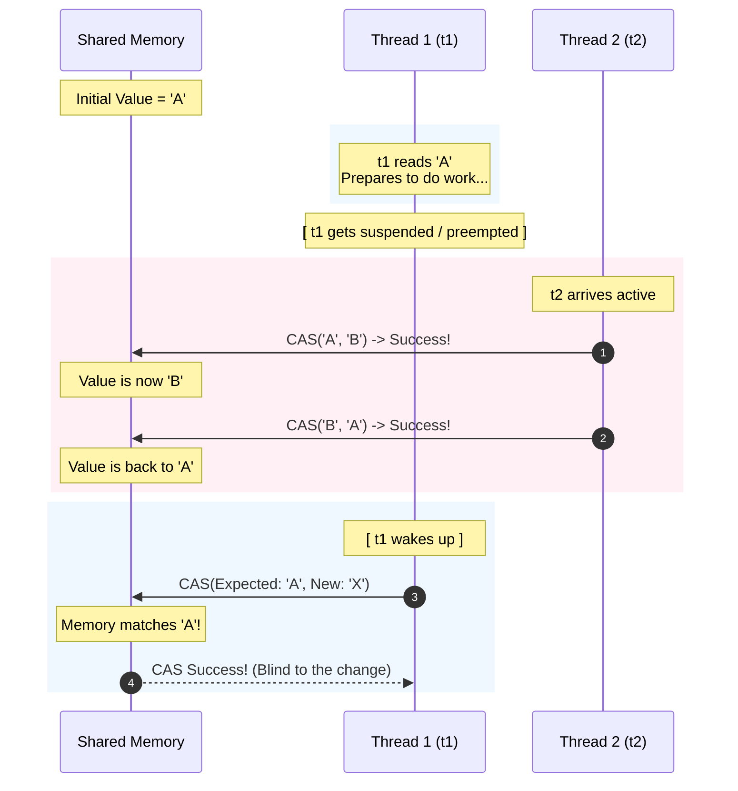
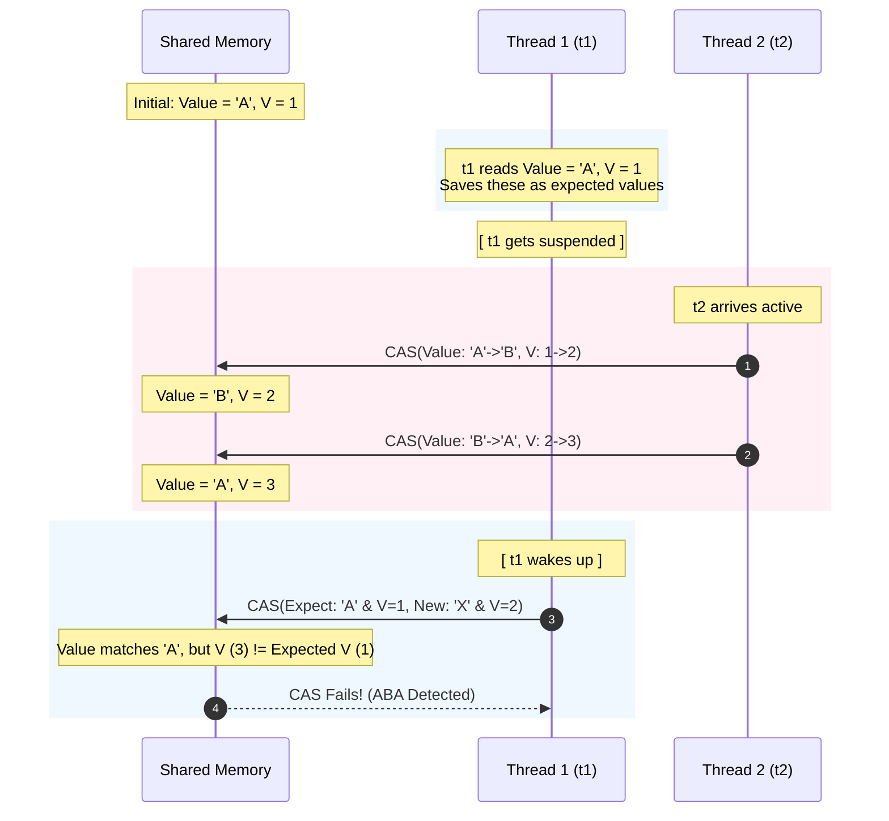

### Lock free concurrency
```java
class Counter{
	int count=0;
	void increment(){
		count++;
	}
}
```
this will cause race condition. => because count++ is not atomic operation.
protect by locking => but not always favorable because of it's overhead.
can make it work without lock using lock free concurrency
#### Atomic variable
operation will happen in single unit => all or nothing execute.
```java
int x=5
```
this declaration is atomic/single.
--> have Atomic Integer
```java
public class demo {
    public static void main(String[] args) throws Exception {
        Counter c=new Counter();
        Thread t1=new Thread(()->{
            for (int j = 0; j < 10000; j++) c.increment();
        });
        Thread t2=new Thread(()->{
            for (int j = 0; j < 10000; j++) c.increment();
        });
        t1.start();
        t2.start();

        t1.join();
        t2.join();
        System.out.println(c.count); // 18830
    }
}
class Counter{
    int count=0;
    public void increment(){
        count++;
    }
}
```
this has race condition => can use atomic integer whose all operations will be atomic.
```java
import java.util.concurrent.atomic.*;

public class demo {
    public static void main(String[] args) throws Exception {
        Counter c=new Counter();
        Thread t1=new Thread(()->{
            for (int j = 0; j < 10000; j++) c.increment();
        });
        Thread t2=new Thread(()->{
            for (int j = 0; j < 10000; j++) c.increment();
        });
        t1.start();
        t2.start();

        t1.join();
        t2.join();
        System.out.println(c.count); // 20000 always
    }
}
class Counter{
    AtomicInteger count=new AtomicInteger(0);
    public void increment(){
        count.incrementAndGet(); // atomic operation
    }
}
```
there are many such atomic operation
this works for parallel and concurrently threads => will handle it without locking => uses CAS(Compare and set operations).
Methods
- `.get()` -> object of it 
- `.set()` -> set value
- `.incrementAndGet()` -> ++x
- `.getAndIncrement()` -> x++
- `.decrementAndGet()` -> x--
- `.getAndAdd(value)` -> x=x+value
similarly make it `AtomicLong` => used to make IDs
also have `AtomicBoolean` => shareable between threads like had flag(which was volatile) now no need to use volatile keyword.
why no use synchronized always ??
- overhead
- locking mechanism
now, 
```java
if(count.get()>4){
	count.incrementAndGet();
}
```
this is not safe atomic
## Atomic Reference
problem where reference.
example
Seat booking example :- 
```java
class SeatBooking{
	String seat=new String("Empty");
	boolean bookSeat(string person){
		if(seat.equals("Empty")){
			seat=new String(person);
			return true;
		}
		return false;
	}
}
```
if 2 thread enter together and check, thus may race condition will make multiple user on same ticket.
more than one thread will get false true
- can use lock
```java
import java.util.concurrent.atomic.*;

public class demo {
    public static void main(String[] args) throws Exception {
        SeatBookin s=new SeatBookin();
        Thread t1=new Thread(()->{
            s.book("A");
        });
        Thread t2=new Thread(()->{
            s.book("B");
        });
        t1.start();
        t2.start();
        t1.join();
        t2.join();
        System.out.println(s.seat);
        /*
           possible
booked by A
booked by B
         */
    }
}
class SeatBookin{
    String seat=new String("Empty");
    public  boolean book(String s){
        if(seat.equals("Empty")){
            seat=new String(s);
            System.err.println("booked by "+s);
            return true;
        }
        return false;
    }
}
```
can use atomic reference
```java
import java.util.concurrent.atomic.*;

public class demo {
    public static void main(String[] args) throws Exception {
        SeatBookin s=new SeatBookin();
        Thread t1=new Thread(()->{
            s.book("A");
        });
        Thread t2=new Thread(()->{
            s.book("B");
        });
        t1.start();
        t2.start();
        t1.join();
        t2.join();
        System.out.println(s.seat);
        /*
           possible
booked by B/A
         */
    }
}
class SeatBookin{
    AtomicReference<String> seat=new AtomicReference<>("Empty");
    public boolean book(String s){
        if(seat.get().equals("Empty")==false){
            return false;
        }
        return seat.compareAndSet("Empty", "booked by "+s);
    }
}
```
will work lock less concurrency and parallel
as `compareAndSet` => atomic operation This is CAS operation.
#### CAS
why 2 thread can't enter at once, without using locks.
concurrently is works, parallel why?
- It is a lock signal
	- CAS -> send special instruction to CPU name CMPXCG has prefix lock
	- on this command, CPU will say all processor and memory control to be 1 cycle behind(as CPU is performing atomic operation).
- memory control
	- if it gets same CAS request from multiple process then also, as memory control is a electronic device it will get only 1 request at a time.
	- thus, will not take 2 request at a time.
	- at a time only one signal can pass => because physics
	- like busier game ![[Pasted image 20260629153615.png|153]] signal travel through wire thus, will get only one winner.
as internal all are gates can't be half open and close at same time.
Thus, CPU makes sure CAS operations will work

### Volatile v/s atomic
- Volatile
	- Visibility solver
- Atomic
	- it make atomic operations
	- thus, this are by default volatile
in Atomic reference can use `set.CompareAndSet(expectedValue,newValue)`
This returns true/false based on updated or not.
will make only one thread can take it.
but if need to update by many threads
Lock free retry loop
example 
- like counter => if many thread like together, need to make sure avoid race condition. need to use lock free
```java
import java.util.concurrent.atomic.AtomicReference;

import java.util.concurrent.atomic.*;

public class demo {
    public static void main(String[] args) {
        LikeCounter lc = new LikeCounter();
        Thread t1 = new Thread(()->lc.like());
        Thread t2 = new Thread(()->lc.like());
        Thread t3 = new Thread(()->lc.like());
        Thread t4 = new Thread(()->lc.like());
        Thread t5 = new Thread(()->lc.like());
        Thread t6 = new Thread(()->lc.like());
        Thread t7 = new Thread(()->lc.like());
        Thread t8 = new Thread(()->lc.like());
        t1.start();t2.start();t3.start();t4.start();t5.start();t6.start();t7.start();t8.start();
        try {
            Thread.sleep(1000);
        } catch (Exception e) {}

        System.out.println("total like number is "+lc.getTotal());
        /*
Conflict detectedretrying
Conflict detectedretrying
Conflict detectedretrying
Conflict detectedretrying
total like number is 8
         */
    }
}
class LikeCounter{
    AtomicReference<Integer> total = new AtomicReference<>(0);
    public void like(){
        // total.set(total.get()+1); // for 100000 -> 81298  Not atomic
        int value = total.get();
        while(true){
            // 1. We will capture the latest 
            value = total.get();
            // 2. increment by 1 ? iff match old value
            if(total.compareAndSet(value,value+1)) break;
            // 3. if thread reaches here, someone else has updated value : retry
            System.err.println("Conflict detected"+"retrying");
        }
    }
    public int getTotal(){return total.get();}
}
```
no of conflict changes.
we try to recalculate/retry(by while loop) so increment of all thread is taken into account.(no like is missed).
### Atomic reference array
make array of atomic reference
`int[] arr=new int[10];` -> not thread safe 
`AtomicReferenceArray<Integer> arr=new AtomicReferenceArray<>(5)` this is used as
```java
// add values
arr.set(0,"Meow");
arr.set(1,""mega);

// CAS
arr.CompareAndSet(2,expectedValue,newValeu);
```
now can do multiple seat in seat booking.
> [!note]
> AtomicInteger/Long/Boolean  all uses same CAS of atomic reference internaly

```java
class LikeCounter{
    AtomicReference<Integer> total = new AtomicReference<>(0);
    public void like(){
        // total.set(total.get()+1); // for 100000 -> 81298  Not atomic
        int value = total.get();
        while(true){
            // 1. We will capture the latest 
            value = total.get();
            // 2. increment by 1 ? iff match old value
            if(total.compareAndSet(value,value+1)) break;
            // 3. if thread reaches here, someone else has updated value : retry
            System.err.println("Conflict detected"+"retrying");
        }
    }
    public int getTotal(){return total.get();}
}
```
can be converted to
```java
class LikeCounter{
    AtomicInteger total = new AtomicInteger(0);
    public void like(){
        total.incrementAndGet();
    }
    public int getTotal(){return total.get();}
}
```
will have output => as atomic integer uses retry logic internally.
#### CAS
compare and Set(CAS) + retry logic method => implemented using Compare and Swap.
this of form
```java
read --> modify --> write
```
CAS -> check before modify that value if same as we read it previously. compare and swap => avoided race condition.

| Lock                                      | CAS                               |
| ----------------------------------------- | --------------------------------- |
| only 1 thread enters                      | multiple threads can enter        |
| thread in waiting.                        | will retry in if race condition   |
| only one thread is allowed to try at once | all try together only one success |
| more overhead                             | less overhead                     |
| more wide application                     | limited application               |
### ABA problem
CAS don't solve ABA problem by it's own.

Reason: it ignores history and only check current value and previous value compare.
Sometime this is not problem(example in like counter) but,
other times it is.
Solve by -> value and version and check both.

