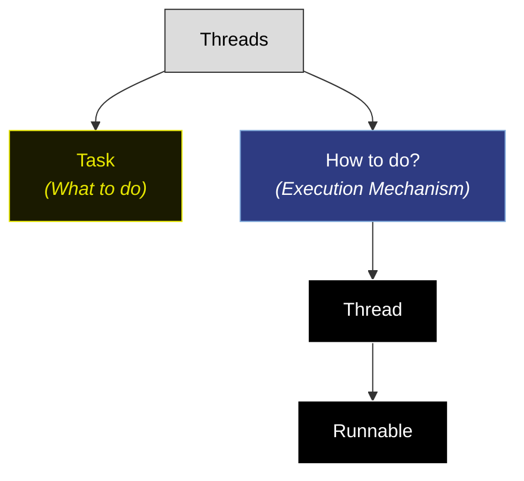
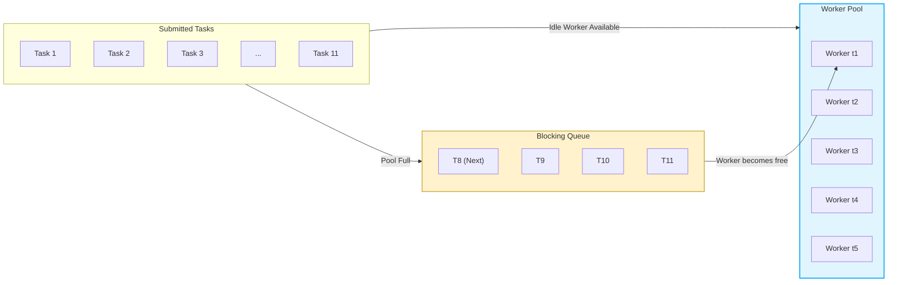
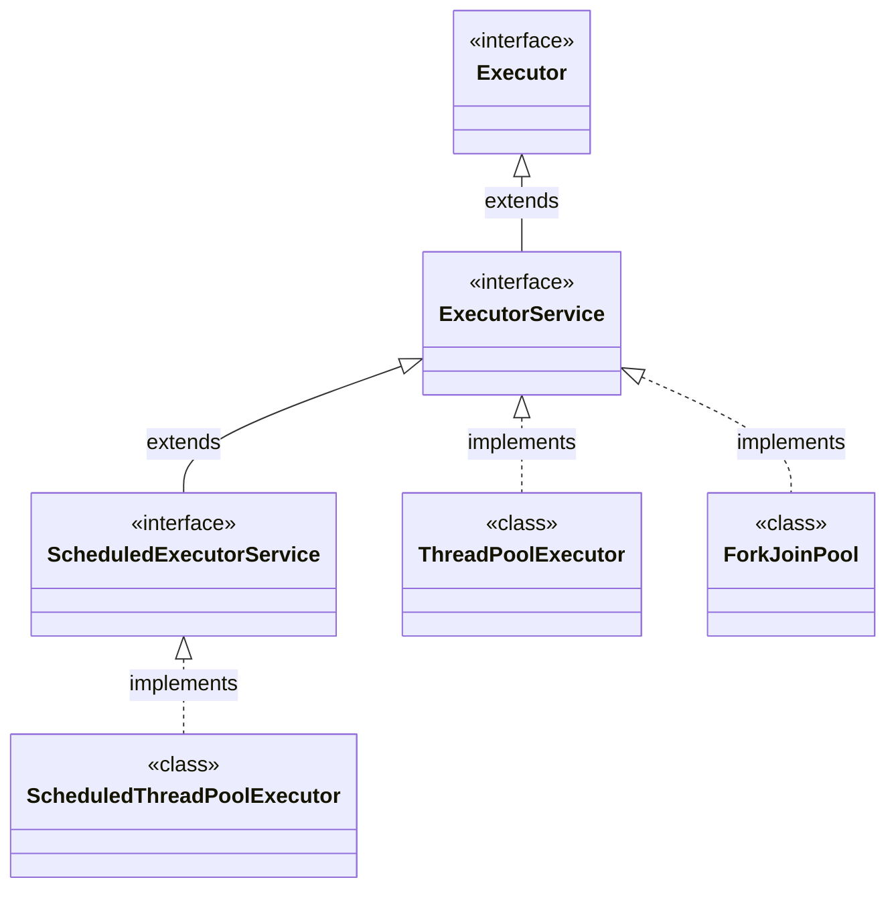
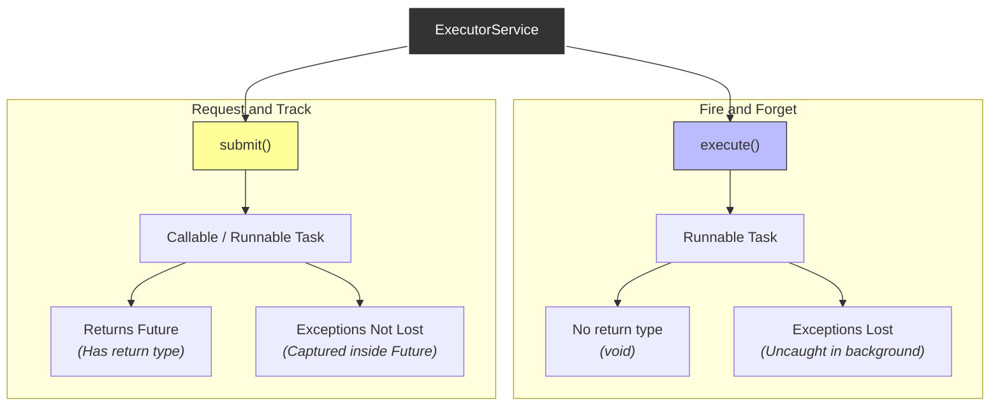

We create thread manually, may lead to complexity.
- memory allocation
```java
Thread t1=new Thread;
t1.start();
```
each thread get `512KB` to `1MB` space.
- OS scheduling => as limited core making many threads will lead to many context switching(waste of time) lead to thrashing(switching)
- Thread creation takes time.
- doing all that to make thread for 1 time use which is waste of resources.
Thus, manual is bad approach. as like hire new chief to make new dish and then fire him.
Thus, to solve it by Executor framework

java will bring a frame work (like collection framework)
it only ask what to do(Task) => no how.
It is done using new concept thread pool
## Thread pool
There are many threads called workers in this pool.
each task is assigned to thread/worker.
This thread/worker in thread pool will not terminate after task it will go to thread pool.
life cycle is managed by thread pool. => thread repeatability.
It has queue => for tasks (if thread no available will send in queue). thus fair.

if queue is full => task will be discard.
There are many types of thread pool(which are different but all have a pool of threads to manage task).
### Tasks
This task are `Runable` type of object.
Executor framework -> Thread pool -> task assigned -> task executed
```java
import java.util.concurrent.ExecutorService;
import java.util.concurrent.Executors;

public class demo {
    public static void main(String[] args) {
        // make ExecutorService object using Executors utility class => fixedThreadPool
        ExecutorService executorService = Executors.newFixedThreadPool(2);
        // no of task =5
        for (int i = 0; i < 5; i++) {
            int taskid = i;
            executorService.execute(()->{
                System.out.println("task "+taskid + " is performed by "+ Thread.currentThread().getName());
            });
        }
        executorService.shutdown(); // to terminate the ExecutorService all thread
/*
task 1 is performed by pool-1-thread-2
task 0 is performed by pool-1-thread-1
task 2 is performed by pool-1-thread-2
task 3 is performed by pool-1-thread-1
task 4 is performed by pool-1-thread-2
 */
    }
}
```
order of execution is un-defined => but, still there is fairness when tasks are in queue.
> [!note]
> Executor framework becomes backbone of webdev in springboot

for each client will give task => queue them 
serialized task with concurrency
## Executor framework

Executor has only one method `execute` (functional interface)
methods to manage thread pool lies in `ExcutorService`.
## Executor interface
```java
interface Executor{
	void execute(Runnable r);
}
```
## `ExecutorService` interface
has method
- `execute(Runnable r)`
- `submit(Callable c)` -> `Callable` is similar to `Runable`, it returns => something![[Pasted image 20260701133349.png]]
```java
// Runable : consumer
()->System.out.println("he");
// Callable : Function
()-> 10+20;
()->{return a;}
```
use return => return is asynchronous
```java
Future<Integer> f1=executor.submit(()->10);
```
Future is a class which accepts object asynchronously.
task will run in background thread.
Result stored in Future => `f1.get()` -> this will await(block) current thread till `f1` gets an output. => can give `InterruptedException` error.
```java
import java.util.concurrent.*;

public class demo {
    public static void main(String[] args) throws Exception{
        ExecutorService executor = Executors.newFixedThreadPool(3);
        Future<Integer> future = executor.submit(() -> {
            System.out.println("hello world");
            return 10;
        });
        System.out.println(future.isDone());
        System.out.println(future.get());
        System.out.println(future.isDone());
        executor.shutdown();
        /*
false
hello world
10
true
         */
    }
}
```
- `.shutdown()` -> from now now not to take any more task and let the current task complete(i.e wait for task to be done and not take more task then terminate all threads in the pool)
- `.shutdownNow()` -> not guarantee that it will be able to terminate running task only can request.
- `.invokeAll(List<Callable> tasks)` -> invoke all task together(like can be done using loop over list) it will return list of Futures
- `.invokeAny(List<Callable tasks>)` -> return single Future by executing any one of this tasks
```java
import java.util.concurrent.*;

public class demo {
    public static void main(String[] args) {
        ExecutorService executor = Executors.newFixedThreadPool(2);
        executor.submit(() -> {
            int x=10/0;
        }); // can't catch the exception

        Future<Integer> future = executor.submit(() -> 1/0);
        try {
            System.out.println(future.get()); // java.lang.ArithmeticException: / by zero
        } catch (Exception e) {
            System.err.println(e);
        }
        executor.shutdown();
    }
}
```
Can't catch `Runable` exception because occurred in different thread but in `Callable` exception is carried out in Future thus, can be catch in current thread.

## `ThreadPoolExecutor` class
It is a configurable engine with limited worker thread and a queue to hold extra tasks/request and rules.
```java
ExecutorService executor = Executors.newFixedThreadPool(2);
```
no need to config and make executor => Executors call will give pre-build executor.
This(`Executors`) it make new `ThreadPoolExecutor` internally
```java
new ThreadPoolExecutor (
    int currPoolSize,  // min alive thread (e.g 2)
    int maximumPoolSize,// max allowed threads (e.g 5)
    long keepAliveTime, // time allowed for extra thread if idle
    TimeUnit unit,
    BlockingQueue<Runnable> workQueue // queue for tasks, can be of fixed size or unlimited size
);
```
can add more thread if many task comes.
`keepAliveTime` -> time(in idle state) after which extra(other than current size) thread will be terminated. 
Rules: 
- if current thread < core pool size => create a thread to execute coming task.
- else if(new task came but all current thread are busy) and (q has space) => put task in queue.
- else if(queue is full and new task comes) and (threads<max) create new thread and pop task from queue to make space in queue for coming task.
- else (at max thread count queue is full and new task comes) Reject the task
Reject task is very rare.
Thus, using max thread count and queue size we know the limits of out system about concurrency.
```java
import java.util.concurrent.ThreadPoolExecutor;

import java.util.concurrent.*;

public class demo {
    public static void main(String[] args) {
        ThreadPoolExecutor pool = new ThreadPoolExecutor(
                2, 
                5, 
                10, 
                TimeUnit.SECONDS,
                new ArrayBlockingQueue<>(2)
                );
        for (int i = 1; i <=5; i++) {
            int taskid=i;
            pool.execute(() -> {
                System.out.println("Task "+taskid+"  is performed by "+Thread.currentThread().getName());
                try {
                    Thread.sleep(2000);
                } catch (Exception e) {}
            });
        }
        pool.shutdown();
        /*
Task 1  is performed by pool-1-thread-1
Task 5  is performed by pool-1-thread-3 // extra
Task 2  is performed by pool-1-thread-2
Task 3  is performed by pool-1-thread-1
Task 4  is performed by pool-1-thread-2
         */
    }
}
```
Generally, we use utility class.
#### Types of queue
- `ArrayBlockingQueue(size)` -> uses array thus, it is of fixed size.
- `LinkedBlockingQueue()` -> linked list, infinite size.
#### Executor class
has many function to make different type of thread pools
`.newFixedThreadPool(size)` ,`.newCachedThreadPool()`
#### `newFixedThreadPool`
It use fixed number of threads and unbounded(infinite) queue.
may lead to memory issue
#### `newCachedThreadPool`
unlimited thread and no queue(null).
will make thread for task no queue.
threads are created on demand and keep alive time is 60 seconds
takes more memory and slow
#### `SingleThreadPool`
1 thread and queue => serializable task.
for logging system
#### `ScheduleThreadPool`
run task in future.
has special method -> `.schedule(Runnable r,time,timeUnit)` -> will perform task after time `t`.
also `.scheduleAtFixedRate(Runnable,initial time,fixed rate,timeUnit)` -> after e.g happen 0,2,4,6,.. seconds
### Rejection policy
it is rule which to use when all threads are maxed and busy and queue is full.
- by default it is abort policy => throw `RejectedExecution`
- Discard policy -> silently discard no throw
- Discard oldest(most used policy) -> remove oldest task from queue and add this task in queue.
