Future is a class => which stores result of asynchronous call.
```java
Futue f1=executor.submit(Callable c);
```
submit has 3 overloads
- submit with callable 
```java
Futue<Integer> i=execute.submit(()->10);
int ans=i.get(); // block current thread that is await
```
- submit with runnable
```java
Futue<?> f1=executor.submit(()->System.out.println("Hello"));
// f1 stores null
f1.isDone();
f1.cancel();
```
- submit with runnable with a predefined result
```java
Future<String> f1=executor.submit(()->{print("Hello")},"Success");
// f1.get() will give "Success" when runnable has run
```
There are many methods in Future thus, we try to collect runnable also in it.
#### Methods in future
- `f1.get()` -> will block the current thread for this task. then will return the value the task generated. did sync operation then did async. => breaks concurrency. => check exception `InterruptedException`,`ExecutionExeception`
- `f1.get(timeout,unit)` -> wait for that time for if completed in time then get, else throw exception `TimeOut`
- `f1.isDone()` -> without blocking main thread it check if task is completed or not.(used often)
- `f1.cancel(boolean mayInterruptedIfRunning)` => will cancel task 2 chooses
	- if not started(i.e in queue) => cancel easy
	- if task is running then,
		- true -> try to interrupt 
		- false -> not interrupt(i.e let it finish)
- `f1.isCancelled()` -> return boolean
Limitation of future => leads to `CompletableFuture`
- `.get()` -> block main thread => breaks parallel 
- It is passive => check or wait
- cannot connect/chain multiple result.
thus, have advance version of Future as `CompleteableFuture`
## `CompletableFuture`
it uses it's own executor -> using it `CompletableFuture` has static method `.supplyAsync`
```java
CompletableFuture<Integer> i=CompletableFuture.supplyAsync(()->10);
```
It uses fork join thread pool
has 2 method 
![[Pasted image 20260702143237.png]]
can chain values 
#### Chaining
| **Method**         | **Functional Interface** | **Input**                   | **Output / Return Value**            | **Role in the Chain**                                                                                         |
| ------------------ | ------------------------ | --------------------------- | ------------------------------------ | ------------------------------------------------------------------------------------------------------------- |
| **`thenApply()`**  | **`Function<T, R>`**     | Receives result of type `T` | Returns transformed data of type `R` | **Intermediate Stage:** Used to transform, filter, or manipulate data. Passes progress down the pipeline.     |
| **`thenAccept()`** | **`Consumer<T>`**        | Receives result of type `T` | Returns nothing (`Void`)             | **Terminal Stage:** Used to consume the final output (e.g., logging, printing, saving to DB). Ends the chain. |
```java
import java.util.concurrent.*;

public class demo {
    public static void main(String[] args) {
        CompletableFuture<Integer> f = CompletableFuture
            .supplyAsync(() -> 10)
            .thenApply(i -> i * 2)
            .thenApply(i -> i + 1);


        try {
            System.out.println(f.get()); // 21
        } catch (Exception e) {}

    }
}
```
can also consume it
```java
import java.util.concurrent.*;

public class demo {
    public static void main(String[] args) {
        CompletableFuture<Void> f = CompletableFuture
            .supplyAsync(() -> 10)
            .thenApply(i -> i * 2)
            .thenApply(i -> i + 1)
            .thenAccept(System.out::println); // 21
    }
}
```
also can do run something
```java
import java.util.concurrent.*;

public class demo {
    public static void main(String[] args) {
        CompletableFuture<Void> f = CompletableFuture
            .supplyAsync(() -> 10)
            .thenApply(i -> i * 2)
            .thenApply(i -> i + 1)
            .thenRun(()->System.err.println("Done")) // Done
    }
}
```
also have then combine more than multiple complete-able Future.
```java
import java.util.concurrent.*;

public class demo {
    public static void main(String[] args) {
        CompletableFuture<Integer> f1=CompletableFuture.supplyAsync(()->10);
        CompletableFuture<Integer> f2=CompletableFuture.supplyAsync(()->20);

        CompletableFuture<Void> f3=f1.thenCombine(f2, (x,y)->x+y)
            .thenAccept(System.out::println); // 30

    }
}
```
- this chaining is non-blocking thus, very use full
can pass a executor in it=> to use instead of fork join pool.
```java
CompletableFuture<Integer> f=CompletableFuture.supplyAsync(()->10,executor);
```
## Fork-Join pool Executor
brings more parallelisms.
divide task to sub-task => divides many parts and do each task parallel.
Divide recursively till base condition.
then join all to make final result thus, more fast.
follows `Divide and conque` approach.
each thread have there own work-stealing queue.

```mermaid
graph LR
    %% Submission Phase
    SubQueue["Submission Queue<br/>(External tasks submitted via execute/submit)"] -->|Shared Entry| PoolBlock

    %% Internal Thread Pool Structure
    subgraph PoolBlock ["ForkJoinPool Thread Manager"]
        direction TB
        
        subgraph Worker1 ["Worker Thread 1 (T1)"]
            T1["Thread T1 Engine"] <--> Deque1["Local Deque (Work-Stealing Queue 1)<br/>[Head ... Tail]"]
        end

        subgraph Worker2 ["Worker Thread 2 (T2)"]
            T2["Thread T2 Engine"] <--> Deque2["Local Deque (Work-Stealing Queue 2)<br/>[Head ... Tail]"]
        end
    end

    %% Stealing Interaction
    Deque2 -.->|T2 steals from Tail when idle| Deque1
    Deque1 -.->|T1 steals from Tail when idle| Deque2

    %% Styling Matrix
    classDef default fill:#1e1e2e,stroke:#cdd6f4,stroke-width:2px,color:#cdd6f4;
    classDef submission fill:#313244,stroke:#fab387,stroke-width:2px,color:#fab387;
    classDef thread fill:#a6e3a1,stroke:#a6e3a1,stroke-width:2px,color:#11111b;
    classDef deque fill:#1e1b4b,stroke:#818cf8,stroke-width:2px,color:#e0e7ff;

    class SubQueue submission;
    class T1,T2 thread;
    class Deque1,Deque2 deque;
    
    style PoolBlock fill:#11111b,stroke:#cdd6f4,stroke-dasharray: 5 5;
```

there is a main queue and each thread has work-stealing queue.
if a thread is free it can steal task from other thread's queue thus, this queue is called work stealing queue.
only the task which can be divided can take benefit of fork join pool.

```mermaid
graph TD
    %% Task Submission Phase
    subgraph Submission ["External Tasks Incoming"]
        T1["Task 1"]
        T2["Task 2"]
        T3["Task 3"]
    end

    %% Global Submission Queue State
    SubQueue["Submission Queue<br/>[ ... | T3 ]"]
    T1 & T2 --> SubQueue

    %% Task Splitting / Forking Context
    subgraph Splitting ["Task Decomposition (Fork)"]
        T2_Node["Task 2"] --> ST1["Sub-Task 1 (ST1)"]
        T2_Node --> ST2["Sub-Task 2 (ST2)"]
    end

    %% Active Thread Engine Execution Matrix
    subgraph Pool ["ForkJoinPool Thread State"]
        direction LR
        
        subgraph Worker1 ["Worker Thread T1"]
            Engine1["Executing:<br/><b>Task 1</b>"]
            Deque1["Queue 1:<br/>[ Empty ]"]
            Engine1 --- Deque1
        end

        subgraph Worker2 ["Worker Thread T2"]
            Engine2["Executing:<br/><b>ST1</b>"]
            Deque2["Queue 2:<br/>[ ST2 |   |   ]"]
            Engine2 --- Deque2
        end
    end

    %% Allocation Routing Mappings
    SubQueue -->|T1 picks up| Engine1
    ST1 -->|T2 picks up| Engine2
    ST2 -->|Pushed to local queue| Deque2

    %% Styling Matrix for High-Contrast Scannability
    classDef default fill:#1e1e2e,stroke:#cdd6f4,stroke-width:2px,color:#cdd6f4;
    classDef tasks fill:#313244,stroke:#fab387,stroke-width:2px,color:#fab387;
    classDef subtasks fill:#1e1b4b,stroke:#818cf8,stroke-width:2px,color:#e0e7ff;
    classDef thread fill:#022c22,stroke:#10b981,stroke-width:2px,color:#ffffff;

    class T1,T2,T3,T2_Node tasks;
    class ST1,ST2 subtasks;
    class Engine1,Engine2 thread;
    
    style Pool fill:#11111b,stroke:#10b981,stroke-dasharray: 5 5;
    style Splitting fill:#11111b,stroke:#818cf8,stroke-dasharray: 3 3;
```

main submission is main(priority), if the submission queue and own queue is empty then, steal tasks.
### how to divide and join tasks.
to make a task fork and join able it must inherit from `RecursiveTask` or `RecursiveAction` class.
Task -> returns. 
Action -> no return value.
example need a array sum. => may take O(n) time
use multi-threading for it => fork join 
can divide and conquer => O(logn)
base condition is single-element array.
```java
import java.util.concurrent.*;

public class demo {
    public static void main(String[] args) {
        int arr[]={1,2,3,4,5,6,7,8,9,10};
        ForkJoinPool pool=new ForkJoinPool();
        SumTask task=new SumTask(arr,0,arr.length-1);
        int sum=pool.invoke(task);
        System.err.println(sum); // 55
        pool.shutdown();
    }
}
class SumTask extends RecursiveTask<Integer>{
    private int[] arr;
    private int start;
    private int end;
    public SumTask(int[] arr,int start,int end){
        this.arr=arr;
        this.start=start;
        this.end=end;
    }
    @Override
    protected Integer compute() {
        // base condition
        if(end-start<=2){
            int sum=0;
            for(int i=start;i<=end;i++){
                sum+=arr[i];
            }
            return sum;
        }

        // fork
        int mid=(start+end)/2;
        SumTask left=new SumTask(arr,start,mid);
        SumTask right=new SumTask(arr,mid+1,end);
        left.fork(); // put in work queue(goes to other thread)
        int sum2=right.compute();
        int sum1=left.join(); // wait for right side thread to be done

        // join
        return sum1+sum2;
    }
}
```
can also use utility `Executor.newWorkStealingPool()` uses fork join pool but as per docs should use Fork-join pool object directly.
## Thread local
Multiple thread share heap memory => may lead to race condition.
each object will keep memory for a thread ![[Pasted image 20260702164402.png]]
each thread gets a private value of this name.
```java
class Resource{
	ThreadLocal<String> name =new ThreadLocal<>();
}
/*
There are method on name .set and .get
Thread t1=new Thread(()->{name.set("Meow")});
Thread t2=new Thread(()->{name.set("Kitty")});
*/
```
make private copy of name for each thread thus, no override value by threads and avoid race conditions no need for locks.
why not use local variable instead => need a global variable and can't pass things everywhere like that is important resource.
## Virtual thread
when we do `t1.start()` JVM says to OS make a thread and start.
OS make thread on it's side and JVM make on it's side.
OS thread is real thread and JVM try to make virtual copy of it.(because JVM can only request OS).
![[Pasted image 20260702185416.png]]
Problem: making so, many threads by this method will not be possible as most time goes in switching.
also threads can go to waiting and blocking state.
- in web, make new thread for each user.
This is solved by Executor but, limited concurrency.
There is a syntax to make virtual thread.
![[Pasted image 20260702185817.png]]
when virtual thread has to perform task then, it will be linked to an OS thread.
It's benefits
- less waiting (as only virtual threads wait and real thread will always be running)
- not sent OS thread in blocking only put virtual thread in blocking and do timely checks.
- bring more parallelism
can make 100,000 virtual thread because OS thread will be limited.
one to many mapping.(1 OS thread maps to may virtual thread)
```java
import java.util.concurrent.*;

public class demo {
    public static void main(String[] args) {
        Thread t1=Thread.startVirtualThread(()->{
            System.out.println(Thread.currentThread()+" started"); 
        });
        try {
            t1.join(); // VirtualThread[#27]/runnable@ForkJoinPool-1-worker-1 started
        } catch (Exception e) {}
    }
}
```
need to join as, it is virtual thread and program will end if no real thread is running.
> [!note]
> The program will not end until there is any real alive thread in OS for that program

another way to make thread pool of virtual threads
```java
import java.util.concurrent.*;

public class demo {
    public static void main(String[] args) {
        ExecutorService es=Executors.newVirtualThreadPerTaskExecutor();
        for(int i=0;i<10;i++){
            int id=i;
            es.submit(()->{
                System.out.println("task id "+id+" is running on "+Thread.currentThread());
            });
        }
        try {
            Thread.sleep(2000);
        } catch (Exception e) {}
        es.shutdown();
        /*
task id 6 is running on VirtualThread[#34]/runnable@ForkJoinPool-1-worker-1
task id 5 is running on VirtualThread[#33]/runnable@ForkJoinPool-1-worker-2
task id 1 is running on VirtualThread[#29]/runnable@ForkJoinPool-1-worker-2
task id 7 is running on VirtualThread[#35]/runnable@ForkJoinPool-1-worker-2
task id 4 is running on VirtualThread[#32]/runnable@ForkJoinPool-1-worker-1
task id 0 is running on VirtualThread[#27]/runnable@ForkJoinPool-1-worker-1
task id 9 is running on VirtualThread[#37]/runnable@ForkJoinPool-1-worker-1
task id 2 is running on VirtualThread[#30]/runnable@ForkJoinPool-1-worker-3
task id 3 is running on VirtualThread[#31]/runnable@ForkJoinPool-1-worker-4
task id 8 is running on VirtualThread[#36]/runnable@ForkJoinPool-1-worker-2
         */
    }
}
```
used to make 
- web apps
- API calls
- DB calls
